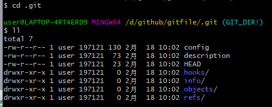
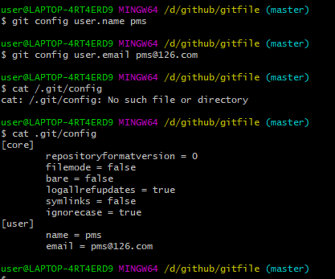
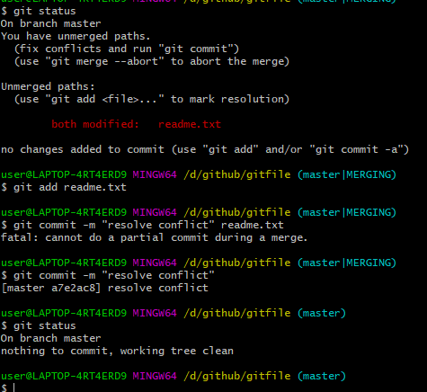
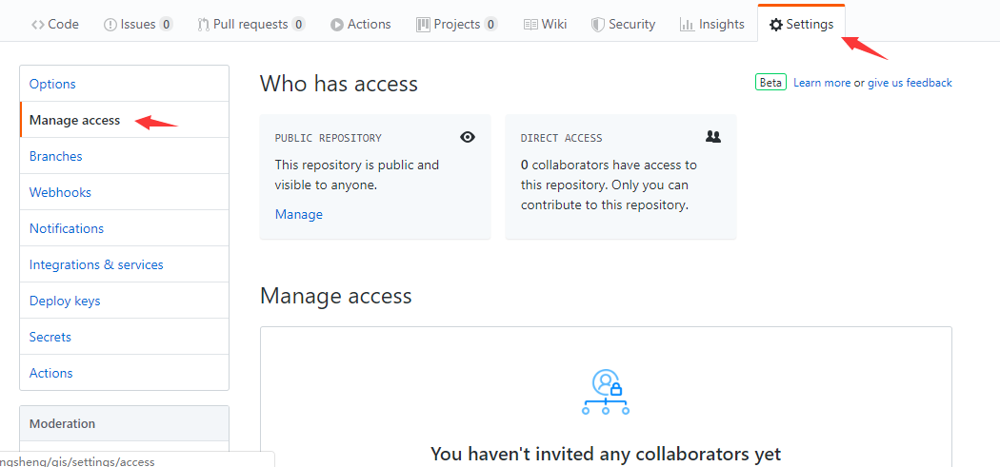

<h1 style="text-align:center">Git使用</h1>

# 1.命令行操作

## 1.1 本地库操作

### 1.1.1 本地库初始化

命令： git init

效果：



注意：.git目录中存放的是本地库相关的子目录和文件，不能删除和修改。

### 1.1.2 设置签名

作用：区分不同的开发人员身份

格式：

​		用户名：pms

​		Email:pms@126.com

注意：这里设置的签名和登录远程库（代码托管中心）的账号、密码没有任何关系。

命令：

  * 项目级别/仓库级别：仅在当前本地库范围内有效

    ``` bash
    git config user.name pms
    git config user.email pms@126.com
    ```

    

  * 系统用户级别：登录当前操作系统的用户范围

    ```shell
    git config --global user.name pms
    
    git config --global user.email pms@126.com
    ```

    

  * 级别优先级：

    * 就近原则：项目级别优先系统用户级别，二者都有时采用项目级别
    * 如果只有系统用户级别的签名，就以系统用户级别的签名为准
    * 二者至少有其中一个

### 1.1.2 基本操作

1. #### 查看状态

   ```shell
   git status
   ```

2. #### 添加操作

   ```shell
   git add 
   ```

   将新增、修改文件添加到暂存区。

3. #### 提交操作

   ```shell
   git commit -m "message"
   ```

   将文件提交到本地代码库。

4. #### 查看历史记录：

   ```powershell
   git log
   commit d209d21c49646cc5bb406bbef583e4a8030f5490
   Author: pms <pms@126.com>
   Date:   Tue Feb 18 10:37:43 2020 +0800
   
       add readme file
   --简洁模式
   git log --pretty=online
   c56f2046c0dbc3b4ae46b62a7bfb4bb83ff0e319 (HEAD -> master) update
   d209d21c49646cc5bb406bbef583e4a8030f5490 add readme file
   
   git log --oneline
   c56f204 (HEAD -> master) update
   d209d21 add readme file
   
   --HEAD@{移动到当前版本需要多少步}
   git reflog
   c56f204 (HEAD -> master) HEAD@{0}: commit: update
   d209d21 HEAD@{1}: commit (initial): add readme file
   
   ```

   

5. #### 版本前进/回退

   * 基于索引值【推荐】

     ```shell
     git reset --hard 索引值
     ```

     

   * 使用^符号:只能后退

     ```shell
     git reset --hard HEAD^
     ```

     一个^后退一步，N个^后退N步。

     

   * 使用~符号

     ```shell
     git reset --hard HEAD~1
     ```

     HEAD~n 后退到第n步

6. #### 删除文件后并找回

   回退到删除前版本

   ```shell
   git reset --hard [指针位置]
   ```

   

7. #### 文件版本比较

   ```shell
   git diff 文件名
   --将工作区中的文件和暂存区进行比较
   git diff 【本地库历史版本】【文件名】
   --将工作区中的文件和本地库历史记录比较
   ```

## 1.2 分支管理

#### 1.2.1 分支的有点

* 同时并行推进多个功能开发，提高开发效率；
* 各个分支在开发过程中，如果某一个分支开发失败，不会对其他分支造成影响，失败分支删除重新开始即可。

#### 1.2.2 分支操作

1. 创建分支

   ```shell
   git branch [分支名]
   --创建并切换
   git branch -b [分支名]
   ```

2. 查看分支

   ```shell
   git branch -v
   ```

3. 切换分支

   ```shell
   git checkout [分支名]
   ```

4. 合并分支

   * 切换到被合并的分支上

   * 执行merge命令

   ```shell
   git checkout [被合并的分支名]
   git merge [修改分支名]
   ```

5. 解决冲突

   1. 删除冲突部分特殊符号

   2. git add 冲突文件

   3. git commit -m "日志信息"

      

   

   ### 1.3 代码提交到远程库

   #### 1.3.1 推送本地代码到远程

   ```shell
   --将远程库地址取别名存到本地
   git remote add pmsgithub https://github.com/pengmengsheng/pengmengsheng.github.io.git
   --将本地master分支提交到远程master分支
   git push origin master
   ```

   

#### 1.3.2 克隆远程库代码

```shell
git clone https://github.com/pengmengsheng/pengmengsheng.github.io.git
```

命令的结果：

* 完整的把远程库下载到本地

* 创建origin远程地址别名

* 初始化本地库

#### 1.3.3 邀请加入团队



#### 1.3.4 pull 拉取代码

pull命令相当于 fetch+merge两个操作命令

1. git fetch [远程地址别名] [远程分支名]：下载远程文件
2. git merge [远程地址别名]/[远程分支名]:与本地库进行合并

#### 1.3.5 跨团队提交

1. 先fork项目,修改 push到远程
2. pull request

