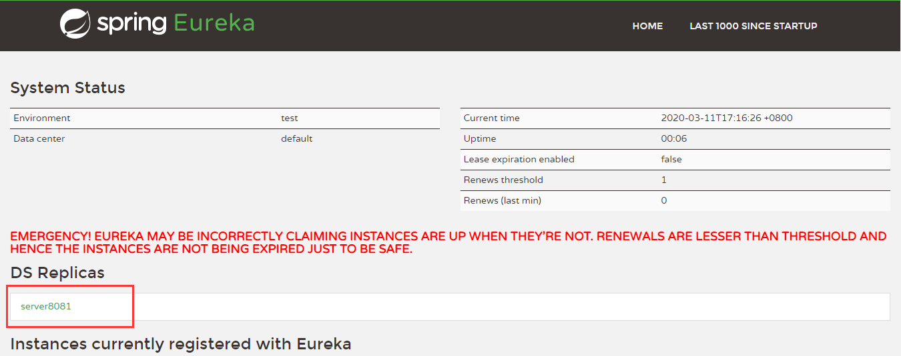
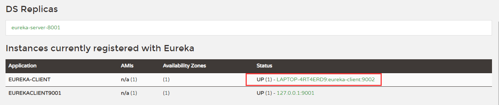
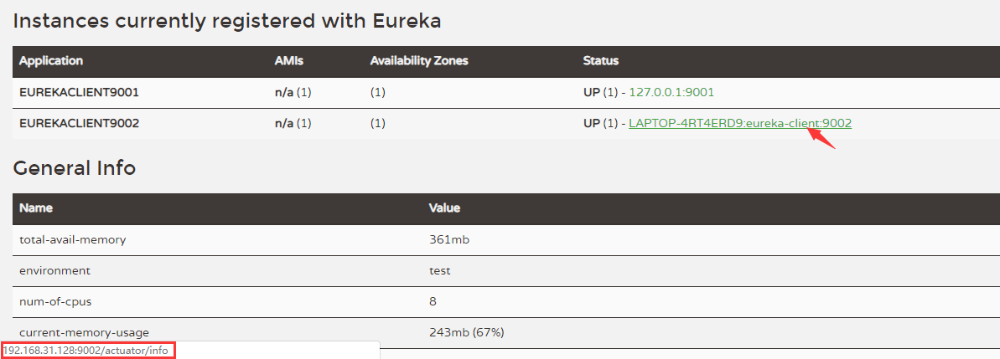
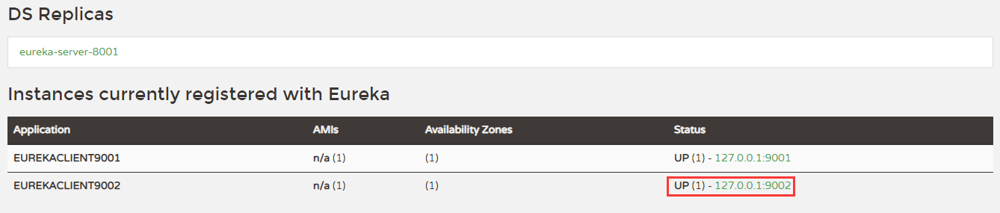

<h1 style="text-align:center">SpringCloud</h1>


# 1.服务注册与发现

## 1.1 Eureka

**已经停止更新**

Eureka采用了CS的设计架构，Eureka Server作为服务注册功能的服务器，它是服务注册中心。而系统中的其他微服务，使用Eureka的客户端连接到Eureka Server并维持心跳连接。这样系统的维护人员就可以通过Eureka Server来监控系统中各个微服务是否正常运行。
在服务注册与发现中，有一个注册中心。当服务器启动的时候，会把当前自己服务器的信息比如服务地址通讯地址等以别名方式注册到注册中心上。另一方(消费者|服务提供者) , 以该别名的方式去注册中心上获取到实际的服务通讯地址，然后再实现本地RPC调用RPC远程调用框架核心设计思想:在于注册中心，因为使用注册中心管理每个服务与服务之间的一个依赖关系(服务治理概念)。在任何RPC远程框架中，都会有一个注册中心(存放服务地址相关信息(接口地址))


###  1.1.1 核心组件

#### 1. Eureka Server

**Eureka Server **提供服务注册服务
各个微服务节点通过配置启动后，会在EurekaServer中进行注册， 这样EurekaServer中的服务注册表中将会存储所有可用服务节点的信息，服务节点的信息可以在界面中直观看到。

```xml
<dependency>
	<groupId>org.springframework.cloud</groupId>
	<artifactId>spring-cloud-starter-netflix-eureka-server</artifactId>
</dependency>
```

```yaml
server:
  port: 8081
eureka:
  instance:
#    服务端的实例名称
    hostname: localhost
  client:
#    是否在注册中心注册自己
    register-with-eureka: false
#    false表示自己就是注册中心
    fetch-registry: false
#    设置eureka server交互的地址查询服务和注册服务都需要依赖这个地址
    service-url:
      defaultZone: http://${eureka.instance.hostname}:${server.port}/eureka/
```

访问地址：http://localhost:8081/

#### 2. Eureka Client

**Eureka Client** 检查注册中新的服务是否还有心跳
是一个Java客户端，用于简化Eureka Server的交互，客户端同时也具备一个内置的、 使用轮询(round-robin)负载算法的负载均衡器在应用启动后，将会向Eureka Server发送心跳(默认周期为30秒)。 如果Eureka Server在多个心跳周期内没有接收到某个节点的心跳，EurekaServer将会从服务注册表中把这个服务节点移除(默认90秒)。

```xml
<dependency>
	<groupId>org.springframework.cloud</groupId>
	<artifactId>spring-cloud-starter-netflix-eureka-client</artifactId>
</dependency>
```

```yaml
eureka:
  client:
    #    是否在注册中心注册自己
    register-with-eureka: true
    #    false表示自己就是注册中心
    fetch-registry: true
    #    设置eureka server交互的地址查询服务和注册服务都需要依赖这个地址
    service-url:
      defaultZone: http://localhost:8081/eureka
```

#### 3. 集群配置 Eureka Server  Cluster

1. 修改C:\Windows\System32\drivers\etc\hosts

	```
		127.0.0.1       server8081
		127.0.0.1       server8091
	```

2. Server 相互注册指向对方地址

	server 8081:

	```yaml
	server:
	  port: 8081
	eureka:
	  instance:
	#    服务端的实例名称
	    hostname: server8081
	  client:
	#    是否在注册中心注册自己
	    register-with-eureka: false
	#    false表示自己就是注册中心
	    fetch-registry: false
	#    设置eureka server交互的地址查询服务和注册服务都需要依赖这个地址
	    service-url:
	      defaultZone: http://server8091:8091/eureka/
	```

	server 8091:

	```yaml
	server:
	  port: 8091
	eureka:
	  instance:
	    #    服务端的实例名称
	    hostname: server8091
	  client:
	    #    是否在注册中心注册自己
	    register-with-eureka: false
	    #    false表示自己就是注册中心
	    fetch-registry: false
	    #    设置eureka server交互的地址查询服务和注册服务都需要依赖这个地址
	    service-url:
	#      集群相互注册
	      defaultZone: http://server8081:8081/eureka/
	```
	
3. 客户端注册：

	```yaml
	server:
	  port: 8082
	eureka:
	  client:
	    #    是否在注册中心注册自己
	    register-with-eureka: true
	    #    false表示自己就是注册中心
	    fetch-registry: true
	    #    设置eureka server交互的地址查询服务和注册服务都需要依赖这个地址
	    service-url:
	#      单机版
	#      defaultZone: http://localhost:8081/eureka
	#集群
	      defaultZone: http://server8081:8081/eureka/,http://server8091:8091/eureka/
	```

	

	访问 server 8091 服务：

	

​	

#### 4. 集群配置 Eureka Client Cluster

##### 4.1 客户端配置

```yaml
server:
  port: 9002

eureka:
  client:
    register-with-eureka: true
    fetch-registry: true
    service-url:
      defaultZone: http://eureka-server-8001:8001/eureka/,http://eureka-server-8002:8002/eureka/
spring:
  application:
    name: eureka-client
```



配置 eureka.instance.appname

```yaml
eureka:
  instance:
    appname: eurekaclient9002
```


配置：eureka.instance.prefer-ip-address

```yaml
eureka:
  instance:
    appname: eurekaclient9002
    prefer-ip-address: true
```



配置：instance-id

```yaml
eureka:
  instance:
  	#默认注册到服务中心，显示的名称是 hostname+appname+port
    appname: eurekaclient9002 
    #使用ip地址来注册到服务中心，显示的是实例名称
    prefer-ip-address: true 
    #设置访问服务的ip地址，一般设置ip-address，都是因为需要通过外网来访问该服务，通常设置为公网ip
    ip-address: 127.0.0.1 
    #设置 注册服务中心，显示的实例名称
    instance-id: ${eureka.instance.ip-address}:${server.port}
```



集群配置相同 eureka.instance.appname

```yaml
eureka:
  instance:
    appname: eurekaclient
```


##### 4.2 消费者开启负载均衡（@LoadBalanced）：

```java
@Configuration
public class EurekaConfig {
    @Bean
    @LoadBalanced
    public RestTemplate restTemplate(){
        return new RestTemplate();
    }
}
```

```xml
<dependency>
    <groupId>org.springframework.cloud</groupId>
    <artifactId>spring-cloud-starter-netflix-eureka-client</artifactId>
    <version>2.2.2.RELEASE</version>
</dependency>
<dependencyManagement>
    <dependencies>
        <dependency>
            <groupId>org.springframework.cloud</groupId>
            <artifactId>spring-cloud-dependencies</artifactId>
            <version>${spring-cloud.version}</version>
            <type>pom</type>
            <scope>import</scope>
        </dependency>
    </dependencies>
</dependencyManagement>
```


#### 5. 消费者调用

consumer使用服务名调用客户端：

```java
@RestController
public class IndexController {
    private final  String url="http://EUREKA-CLIENT";
    @Autowired
    RestTemplate restTemplate;

    @RequestMapping(value = "/ticket/get",method = RequestMethod.GET)
    public String getTicket(){
        System.out.println("开始请求！");
        return restTemplate.getForObject(url+"/ticket",String.class);
    }
}
```

### 1.1.2 客户端服务发现

```java
@Autowired
DiscoveryClient discoveryClient;

public void discovery() {
    //1.
    List<String> services = discoveryClient.getServices();

    //2.
    List<ServiceInstance> instances = discoveryClient.getInstances("EUREKA-CLIENT");
    for (ServiceInstance instance : instances) {
        System.out.println(instance.getHost());//127.0.0.1
        System.out.println(instance.getInstanceId());//127.0.0.1:9002
        System.out.println(instance.getPort());//9002
        System.out.println(instance.getMetadata());//{management.port=9002}
        System.out.println(instance.getScheme());//http
        System.out.println(instance.getUri());//http://127.0.0.1:9001
    }
}
```

```java
//在client主启动类上加上注解
@EnableDiscoveryClient
```

### 1.1.3 Eureka-Server自我保护机制

默认情况下 Eureka Client 定时向 Eureka Server 端发送心跳包如果 Eureka 在 server 端在一定时间内(默认90秒)没有收到 Eureka Client 发送心跳包 ,便会直接从服务注册列表中剔除该服务,但是在短时间( 90秒中)内丢失了大量的服务实例心跳，这时候 Eureka Server 会开启自我保护机制,不会剔除该服务（该现象可能出现在如果网络不通，但是Eureka Client为出现宕机，此时如果换做别的注册中心如果一定时间内没有收到心跳会将剔除该服务,这样就出现了严重失误,因为客户端还能正常发送心跳，只是网络延迟问题，而保护机制是为了解决此问题而产生的）

管理自我保护机制：

eureka-server配置

```yaml
eureka:
	server:
    	enable-self-preservation: false
    
```

eureka-client端配置

```yaml
eureka:
  instance:
#    客户端发送心跳的时间间隔默认30
    lease-renewal-interval-in-seconds: 2
#    服务端在接收最后一次心跳的超时上限，超过就剔除注册服务默认90
    lease-expiration-duration-in-seconds: 1
```

## 1.2 Zookeeper

### 1.2.1 服务提供者

pom.xml

```xml
<dependency>
    <groupId>org.springframework.cloud</groupId>
    <artifactId>spring-cloud-starter-zookeeper-discovery</artifactId>
    <version>2.2.1.RELEASE</version>
    <exclusions>
        <exclusion>
            <groupId>org.apache.zookeeper</groupId>
            <artifactId>zookeeper</artifactId>
        </exclusion>
    </exclusions>
</dependency>
<dependency>
    <groupId>org.apache.zookeeper</groupId>
    <artifactId>zookeeper</artifactId>
    <version>3.5.7</version>
    <exclusions>
        <exclusion>
            <groupId>org.slf4j</groupId>
            <artifactId>slf4j-log4j12</artifactId>
        </exclusion>
    </exclusions>
</dependency>
```

application.yml

```yaml
server:
  port: 8001
spring:
  application:
    name: zookeeper-client
  cloud:
    zookeeper:
      connect-string: localhost:2181
```

主启动类：向 zookeeper 注册中心注册服务

```java
@SpringBootApplication
@EnableDiscoveryClient
public class ZkClientApplication {
    public static void main(String[] args){
        SpringApplication.run(ZkClientApplication.class,args);
    }
}    
```


### 1.2.2 服务消费者

pom 文件和客户端一样

配置 RestTemplate

```java
@Configuration
public class RestTemplateConfig {
    @Bean
    @LoadBalanced
    public RestTemplate restTemplate(){
        return new RestTemplate();
    }
}
```

主启动类：

```java
@SpringBootApplication
@EnableDiscoveryClient
public class ZkConsumerApplication {
    public static void main(String[] args) {
        SpringApplication.run(ZkConsumerApplication.class,args);
    }
}
```

调用：

```java 
@RestController
public class TicketController {
    private static final String CLEINT_URL = "http://zookeeper-client";
    @Autowired
    RestTemplate restTemplate;

    @GetMapping("/ticket")
    public String getTicket(){
        System.out.println("开始调用");
        return restTemplate.getForObject(CLEINT_URL+"/ticket",String.class);
    }
}
```

## 1.3  Consul

https://www.consul.io/intro/index.html

Consul特点：

- **服务发现**：Consul的客户端可以注册服务，例如 `api`或`mysql`，其他客户端可以使用Consul来发现给定服务的提供者。使用DNS或HTTP，应用程序可以轻松找到它们依赖的服务。
- **健康检查**：Consul客户端可以提供大量的健康检查，这些检查可以与给定服务（“ Web服务器返回200 OK”或与本地节点（“内存利用率低于90％”））相关联。操作员可以使用此信息来监视群集的运行状况，服务发现组件可以使用此信息将流量从不正常的主机发送出去。
- **KV存储**： 根据具体用途，应用程序可以使用Consul的键/值分层存储，包括动态配置，功能标记，协调，领导者选举等。简单的HTTP API 使其易于使用。
- **安全的服务通信**：Consul可以为服务生成和分发TLS证书以建立相互TLS连接。 [意图](https://www.consul.io/docs/connect/intentions.html) 可用于定义允许哪些服务进行通信。可以使用可以实时更改的意图轻松管理服务分段，而不用使用复杂的网络拓扑和静态防火墙规则。
- **多数据中心**：Consul开箱即用地支持多个数据中心。这意味着Consul的用户不必担心会构建其他抽象层以扩展到多个区域。

配置：

```yaml
spring:
  application:
    name: consul-consumer
  cloud:
    consul:
      host: localhost
      port: 8500
      discovery:
        service-name: ${spring.application.name}
```

主启动类：

```java
@SpringBootApplication
@EnableDiscoveryClient
public class ConsulConsumerApplication {
    public static void main(String[] args) {
        SpringApplication.run(ConsulConsumerApplication.class,args);
    }
}

```

调用服务：

```java

@RestController
public class TicketController {
    String URL = "http://consul-client";
    @Resource
    RestTemplate restTemplate;
    @GetMapping("/consumer/ticket")
    public String ticket(){
        return restTemplate.getForObject(URL+"/ticket",String.class);
    }
}
```


CAP:关注粒度是数据，而不是整体。

* C:Consistency(强一致性)

* A:Availability(可用性)

* P:partition tolerance（分区容错性）

最多只能同时较好的满足两个。
**CAP理论的核心是:** 一个分布式系统不可能同时很好的满足致性， 可用性和分区容错性这三需求,因此，根据CAP原理将NoSQL数据库分成了满足CA原则、满足CP原则和满足AP原则三大类:

* CA—单点集群，满足一致性,可用性的系统，通常在可扩展性上不太强大。

* CP(zookeeper/consul)一满足一致性,分区容忍必的系统，通常性能不是特别高。

* AP(Eureka)—满足可用性,分区容忍性的系统，通常可能对一致性要求低一些。

	三者比较：


# 2.服务调用

## 2.1 Ribbon

### 2.1.1概述

Spring Cloud Ribbon是基于Netflix Ribbon实现的一套**客户端负载均衡**的工具。

简单的说，Ribbon是Netflix发 布的开源项目，主要功能是提供**客户端的软件负载均衡算法和服务调用**。Ribbon客户端组件提供一系列完善的配置项如连接超时，重试等。简单的说，就是在配置文件中列出Load Balancer (简称LB)后面所有的机器，Ribbon会自动的帮助你基于某种规则(如简单轮询，随机连接等)去连接这些机器。我们很容易使用Ribbon实现自定义的负载均衡算法。

**LB负载均衡(Load Balance)：**简单的说就是将用户的请求平摊的分配到多个服务上,从而达到系统的HA (可用)。
常见的负载均衡有软件Nginx, LVS,硬件F5等。

**Ribbon本地负载均衡客户端VS Nginx服务端负载均衡区别：**

- **Nginx是服务器负载均衡**，客户端所有请求都会交给nginx, 然后由nginx实现转发请求。即负载均衡是由服务端实现的。

- **Ribbon本地负载均衡**，在调用微服务接C时候,会在注册中心上获取注册信息服务列表之后缓存到JVM本地,从而在本地实现RPC远程服务调用技术。

负载均衡类别：

- **集中式LB**
	即在服务的消费方consumer和提供方provider之间使用独立的LB设施(可以是硬件,如F5, 也可以是软件,如nginx), 由该设施负责把访问请求通过某种策略转发至服务的提供方;

- **进程内LB**

	将负载均衡逻辑集成到consumer，consumer从服务注册中心获知有哪些地址可用，然后自己再从这些地址中选择出一个合适的provider。

**Ribbon就属于进程内LB**,它只是一个类库, **集成于消费方进程**,消费方通过它来获取到服务提供方的地址。

**Ribbon:负载均衡+RestTemplate调用**

Ribbon在I作时分成两步

* 第一步先选择EurekaServer ,它优先选择在同一个区域内负载较少的server.

* 第二步再根据用户指定的策略，在从server取到的服务注册列表中选择一个地址。

	其中Ribbon提供了多种**策略**:比如轮询、随机和根据响应时间加权。

### 2.1.2 Rbbon核心组件IRULE

默认轮询


### 2.1.3 修改默认策略：

1. 在非主启动类包中加入配置规则：

	```java
	@Configuration
	public class LoadBanlanceRlue {
	
	    @Bean
	    public IRule loadbalanceRule(){
	        return new RandomRule();
	    }
	}
	```

2. 在主启动类中加入注解@**RibbonClient**指定负载策略

	```java
	@SpringBootApplication
	@EnableDiscoveryClient
	@RibbonClient(name = "eureka-client",configuration = LoadBanlanceRlue.class)
	public class ConsulConsumerApplication {
	    public static void main(String[] args) {
	        SpringApplication.run(ConsulConsumerApplication.class,args);
	    }
	}
	```

### 2.1.4 负载均衡算法

**负载均衡算法**: rest接口第几次请求数%服务器集群总数量=实际调用服务器位置下标，每次服务重启动后rest接口计数从1开始。

## 2.2 OpenFeign

Feign是一个**声明式WebService客户端**。 使用Feign能让编写Web Service客户端更加简单。
它的使用方法是**<span style="color:red">定义一个服务接口然后在上面添加注解</span>**。Feignt也**支持可拔插式的编码器和解码器**。

SpringCloud对Feign进行了封装使其支持了Spring MVC标准注解和HttpMessageConverters。

**Feign可以与Eureka和Ribbon组合使用以支持负载均衡**。

前面在使用Ribbon+ RestTemplate时,利用RestTemplate对http请求的封装处理,形成了一套模版化的调用方法。但是在实际开发中,由于对服务依赖的调用可能不止一处, 往往一个接口会被多处调用， 所以通常都会针对每个微服务自行封装一些客户端类来包装这些依赖服务的调用。所以，Feign在此基础上做了进一步封装, 由他来帮助我们定义和实现依赖服务接口的定义。在Feign的实现下,我们只需创建一个接口并使用注解的方式来配置它(以前是Dao接口上面标注Mapper注解现在是一个微服务接口上面标注一个Feign注解即可)，即可完成对服务提供方的接口绑定,简化了使用Spring cloud Ribbon时，自动封装服务调用客户端的开发量。
**Feign集成了Ribbon**
利用Ribbon维护了Payment的服务列表信息，并且通过轮询实现了客户端的负载均衡。与Ribbon不同的是，通过**feign只需要定义服务绑定接口且以声明式的方法**，优雅而简单的实现了服务调用。


### 2.2.1 配置

pom.xml

```xml
<!--openfeign-->
<dependency>
    <groupId>org.springframework.cloud</groupId>
    <artifactId>spring-cloud-starter-openfeign</artifactId>
    <version>2.2.2.RELEASE</version>
</dependency>
<!--eureka-client-->
<dependency>
    <groupId>org.springframework.cloud</groupId>
    <artifactId>spring-cloud-starter-netflix-eureka-client</artifactId>
    <version>2.2.2.RELEASE</version>
</dependency>
```

application.yml

```yaml
eureka:
  client:
    register-with-eureka: false
    fetch-registry: true
    service-url: # 集群
      defaultZone: http://eureka-server-8001:8001/eureka/,http://eureka-server-8002:8002/eureka/
```

服务接口：绑定接口（@FeignClient）且以声明式的方法(@GetMapping)

```java
@Service
@FeignClient(value="eureka-client")
public interface TicketService {

    @GetMapping(value = "/ticket")
    String getTicket();
}
```

主启动类（@EnableFeignClients）：

```java
@SpringBootApplication
@EnableFeignClients
public class OpenFeignConsumerApplication {
    public static void main(String[] args) {
        SpringApplication.run(OpenFeignConsumerApplication.class,args);
    }
}

```

### 2.2.2 超时控制

yml:

```yaml
  client:
    config:
      default:
        connectTimeout: 5000
        readTimeout: 5000
        Level: debug
```

# 3.服务降级

## 3.1 Hystrix

Hystrix是一个用于处理分布式系统的**延迟和容错**的开源库, 在分布式系统里,许多依赖不可避免的会调用失败,比如超时、异常等,Hystrix能够保证在一个依赖出问题的情况下， **不会导致整体服务失败，避免级联故障，以提高分布式系统的弹性**。
"**断路器**”本身是一种开关装置， 当某个服务单元发生故障之后,通过断路器的故障监控(类似熔断保险丝)，**向调用方返回一个符合预期的、可处理的备选响应(FallBack) ，而不是长时间的等待或者抛出调用方无法处理的异常**，这样就保证了服务调用方的线程不会被长时间、不必要地占用，从而避免了故障在分布式系统中的蔓延，乃至雪崩。

* 服务降级

	可以放到客户端和服务端，通常放到客户端

	导致服务降级的情况：

	1. 程序运行异常
	2. 超时
	3. 服务熔断
	4. 线程池/信号量满时

* 服务熔断

	**熔断机制**是应对雪崩效应的一-种微服务链路保护机制。当扇出链路的某个微服务出错不可用或者响应时间太长时,会进行服务的降级，进而熔断该节点微服务的调用，快速返回错误的响应信息。

	**当检测到该节点微服务调用响应正常后，恢复调用链路。**

	**服务熔断-》服务降级-》恢复调用链路**

	在Spring Cloud框架里,熔断机制通过Hystrix实现。Hystrix会监控微服务间调用的状况,当失败的调用到一定阈值,缺省是5秒内20次调用失败,就会启动熔断机制。熔断机制的注解是@HystrixCommand.

* 服务限流

## 3.2 示例

### 3.2.1 client端配置

client pom.xml

```xml
<dependency>
    <groupId>org.springframework.cloud</groupId>
    <artifactId>spring-cloud-starter-netflix-eureka-client</artifactId>
    <version>2.2.2.RELEASE</version>
</dependency>
<dependency>
    <groupId>org.springframework.cloud</groupId>
    <artifactId>spring-cloud-starter-netflix-hystrix</artifactId>
    <version>2.2.2.RELEASE</version>
</dependency>
```

服务降级设置（**@HystrixCommand**）：

```java
  @GetMapping("/ticket/timeout")
  @HystrixCommand(fallbackMethod="timeout3",commandProperties={            @HystrixProperty(name="execution.isolation.thread.timeoutInMilliseconds",value="3000")
    })
    public String timeout(){
        try {
            TimeUnit.SECONDS.sleep(5);
        } catch (InterruptedException e) {
            e.printStackTrace();
        }
        return "timeout5秒";
    }

    public String timeout3(){
        try {
            TimeUnit.SECONDS.sleep(3);
        } catch (InterruptedException e) {
            e.printStackTrace();
        }
        return "系统超时，请稍后再试";
    }
```

主启动类（**@EnableCircuitBreaker**）：

```java
@SpringBootApplication
@EnableDiscoveryClient
@EnableCircuitBreaker
public class HystrixClientApplication {
    public static void main(String[] args) {
        SpringApplication.run(HystrixClientApplication.class,args);
    }
}
```

### 3.2.2 消费者配置

pom.xml

```xml
 <dependency>
     <groupId>org.springframework.cloud</groupId>
     <artifactId>spring-cloud-starter-netflix-eureka-client</artifactId>
     <version>2.2.2.RELEASE</version>
</dependency>
<dependency>
    <groupId>org.springframework.cloud</groupId>
    <artifactId>spring-cloud-starter-netflix-hystrix</artifactId>
    <version>2.2.2.RELEASE</version>
</dependency>
<dependency>
    <groupId>org.springframework.cloud</groupId>
    <artifactId>spring-cloud-starter-openfeign</artifactId>
    <version>2.2.2.RELEASE</version>
</dependency>
```

application.yml

```yaml
server:
  port: 80
spring:
  application:
    name: hystrix-consumer
eureka:
  client:
    fetch-registry: true
    register-with-eureka: false
    service-url:
      defaultZone: http://localhost:8001/eureka
feign:
  hystrix:
    enabled: true
```

主启动类：

```java
@SpringBootApplication
@EnableFeignClients
@EnableCircuitBreaker
public class HystrixConsumerApplication {
    public static void main(String[] args) {
        SpringApplication.run(HystrixConsumerApplication.class,args);
    }
}
```

服务降级设置

```java

@GetMapping("/consumer/ticket/timeout")
@HystrixCommand(fallbackMethod="timeout2",commandProperties={            @HystrixProperty(name="execution.isolation.thread.timeoutInMilliseconds",value="2000") })
String timeout() {
    return ticketService.timeout();
}
String timeout2() {
    return "响应超时";
}
```

### 3.2.3 设置默认降级处理

```java
@DefaultProperties(defaultFallback="timeout2")
@RestController
public class TicketController
```

### 3.2.4 服务降级-fallback

实现FeignClien接口：

```java
@FeignClient(value = "hystrix-client",fallback = FallBackServiceImpl.class)
public interface TicketService {

    @GetMapping("/ticket/get")
     String ticket();

    @GetMapping("/ticket/timeout")
     String timeout();
}
@Component
public class FallBackServiceImpl implements TicketService {
    @Override
    public String ticket() {
        return "ticket fallback";
    }

    @Override
    public String timeout() {
        return "timeout fallback";
    }
}
```

### 3.2.5 服务熔断

#### 3.2.5.1 实现

```java
   @HystrixCommand(fallbackMethod="timeout3",commandProperties={
   @HystrixProperty(name= "circuitBreaker.enable",value="true"),// 是否开启断路器
            @HystrixProperty(name="circuitBreaker.requestVolumeThreshold",value="10"),//请求次数
            @HystrixProperty(name="circuitBreaker.sleepWindowInMilliseconds",value="10000"),//时间窗口期
            @HystrixProperty(name="circuitBreaker.errorThresholdPercentage",value="60")// 失败率达到多少后跳闸
    })
    //具体属性在HystrixCommandProperties类中
    public String timeout(){
        try {
            TimeUnit.SECONDS.sleep(5);
        } catch (InterruptedException e) {
            e.printStackTrace();
        }
        return "timeout5秒";
    }
```

涉汲到断路器的三个重要参数:**快照时间窗、请求总数阀值、错误百分比阀值。**

1. 快照时间窗:断路器确定是否打开需要统计一些请求和错误数据， 而统计的时间范围就是快照时间窗，默认为最近的10秒。

2. 请求总数阀值:在快照时间窗内，必须满足请求总数阀值才有资格熔断。默认为20,意味着在10秒内,如果该hystrix命令的调用次数不足20次,
	即使所有的请求都超时或其他原因失败，断路器都不会打开。

3. 错误百分比阀值:当请求总数在快照时间窗内超过了阀值,比如发生了30次调用，如果在这30次调用中，有15次发生了超时异常,也就是超过
	50%的错误百分比,在默认设定50%阀值情况下，这时候就会将断路器打开。

#### 3.2.5.2: 服务熔断类型

* 熔断打开
	请求不再进行调用当前服务，内部设置时钟一般为MTTR (平均故障处理时间)，当打开时长达到所设时钟则进入半熔断状态

* 熔断关闭
	熔断关闭不会对服务进行熔断

* 熔断半开
	部分请求根据规则调用当前服务，如果请求成功且符合规则则认为当前服务恢复正常，关闭熔断

https://github.com/Netflix/Hystrix/wiki/How-it-Works


## 3.3 Hystrix dashboard

在pom.xml中引入jar

```xml
<dependency>
    <groupId>org.springframework.cloud</groupId>
    <artifactId>spring-cloud-starter-netflix-hystrix-dashboard</artifactId>
    <version>2.2.2.RELEASE</version>
</dependency>


```

主启动类中加入@EnableHystrixDashboard

# 4.服务网关

## 4.1 zuul

### 4.2 Gateway

Gateway是zull1.x 的替代

SpringCloud Gateway是Spring Cloud的一个全新项目，于Spring 5.0+ Spring Boot 2.0和Project Reactor等技术开发的网关，它旨在为微服务架构提供一种简单有效的统一的API路由管理方式。
SpringCloud Gateway作为Spring Cloud生态系统中的网关,目标是替代Zuul, 在Spring Cloud 2.0以上版本中，没有对新版本的Zuul 2.0以上最新高性能版本进行集成，仍然还是使用的Zuul 1.x非Reactor模式的老版本。而为了提升网关的性能，SpringCloud Gateway是基于WebFlux框架实现的，而WebFlux框架底层则使用了高性能的eactor模式通信框架Netty。
Spring Cloud Gateway的目标提供统一 的路由方式且基于Filter链的方式提供了网关基本的功能，例如:安全，监控/指标,和限流。

#### **4.2.1 基本概念**：

* Route（路由）

	路由是构建网关的基本模块，它由ID，目标URI, 一系列的断言和过滤器组成，如果断言为true则匹配该路由

* Predicate（断言）

	参考的是Java8的java.util.function.Predicate
	开发人员可以匹配HTTP请求中的所有内容(例如请求头或请求参数)，如果请求与断言相匹配则进行路由

* Filter（过滤）

	指的是Spring框架中GatewayFilter的实例， 使用过滤器，可以在请求被路由前或者之后对请求进行修改。

#### 4.2.2 Spring Cloud Gateway功能：

- 基于Spring Framework 5，Project Reactor和Spring Boot 2.0构建
- 能够匹配任何请求属性上的路由。
- 断言和过滤具体路由。
- Hystrix断路器集成。
- Spring Cloud DiscoveryClient集成
- 容易编写的断言和过滤器
- 请求速率限制
- 路径改写

#### 4.2.3 工作流程：

客户端向Spring Cloud Gateway发出请求。如果网关处理程序映射确定请求与路由匹配，则将其发送到网关Web处理程序。该处理程序通过特定于请求的过滤器链来运行请求。筛选器由虚线分隔的原因是，筛选器可以在发送代理请求之前和之后运行逻辑。所有“前置”过滤器逻辑均被执行。然后发出代理请求。发出代理请求后，将运行“后”过滤器逻辑。


# 5.服务配置


# 6.服务总线

