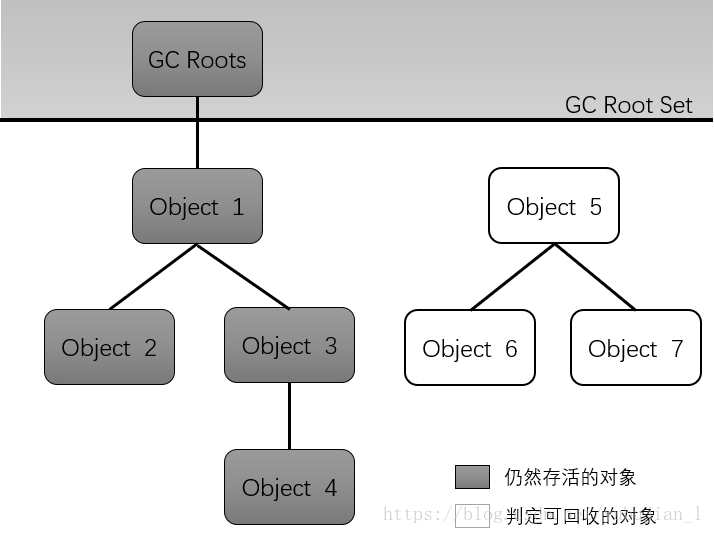
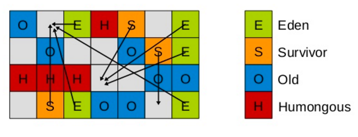
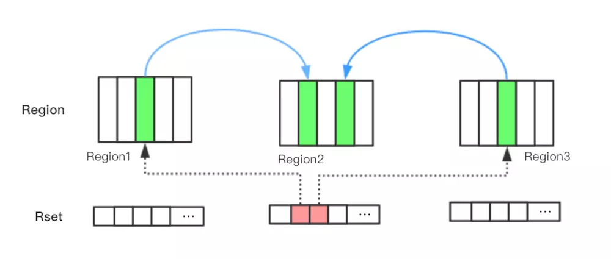

[TOC]

 <h1 style="text-align:center;">常见知识点</h1>
## 1. Volatile

Java虚拟机提供的轻量级同步机制（synchronize），当多个线程操作共享数据时可保证内存中数据**可见**，
**特性**：

1. 内存**可见性**

   内存可见性：当多个线程操作共享数据时，内存中数据彼此可见。

2. 不保证**原子性**

3. **禁止指令重排（有序性）**

## 2. JMM内存模型  
JMM(Java内存模型Java Memory Model)本身是一种抽象的概念**并不真实存在**，它描述的是一组规则或规范，通过这组规范定义了程序中各个变量(包括实例字段，静态字段和构成数组对象的元素)的访问方式。 

JMM关于同步的规定：  

1. 线程解锁前，必须把共享变量的值刷新回主内存；

2. 线程加锁前，必须读取主内存的最新值到自己的工作内存；

3. 加锁解锁是同一把锁；

由于JVM运行程序的实体是线程，而每个线程创建时JVM都会为其创建一个**工作内存(栈空间)**，工作内存是每个线程的私有数据区域，而Java内存模型中规定所有变量都存储在**主内存**，主内存是共享内存区域，所有线程都可以访问，**但线程对变量的操作(读取赋值等)必须在工作内存中进行，首先要将变量从主内存拷贝的自己的工作内存空间，然后对变量进行操作，操作完成后再将变量写回主内存**，不能直接操作主内存中的变量，各个线程中的工作内存中存储着主内存中的**变量副本拷贝**，因此不同的线程间无法访问对方的工作内存，线程间的通信(传值)必须通过主内存来完成，其简要访问过程如下图：

.png)

JMM特性：

1. **原子性**（操作是不可分、操作不可被中断）：是指一个操作是不可中断的。即使是多个线程一起执行的时候，一个操作一旦开始，就不会被其他线程干扰。（Synchronized、Lock）；

2. **可见性**（保障数据的一致，数据安全一部分）：是指当一个线程修改了某一个共享变量的值，其他线程是否能够立即知道这个修改。（Volatile、Synchronized）

3.  **有序性**（按照自己想要执行的顺序执行线程）：有序性是指程序在执行的时候，程序的代码执行顺序和语句的顺序是一致的。（Join）

计算机在执行程序时，为了提高性能，编译器和处理器的常常会对指令做重排，一般分以下3种：
**源代码—><font color="red">编译器优化的重排</font>—><font color="red">指令并行的重排</font>—><font color="red">内存系统的重排</font>—>最终执行的指令**

单线程环境里面确保程序最终执行结果和代码顺序执行的结果一致。
处理器在进行重排序时必须要考虑指令之间的**数据优赖性**
多线程环境中线程交替执行，由于编译器优化重排的存在，两个线程中使用的变量能否保证一致性是无法确定的,结果无法预测。

volatile实现**禁止指令重排优化**。从而避免多线程环境下程序出现乱序执行的现象
**内存屏障(Memory Barrier)**又称内存栅栏，是一个CPU指令，作用:

* 保证特定操作的执行顺序。

* 保证某些变量的内存可见性(利用该特性实现volatile的内存可见性) 。

由于编译器和处理都能执行指令重排优化。如果在指令间插入一条Memory Barrier则会告诉编译器和CPU,不管什么指令都不能和这条Memory Barrier指令重排序，即**通过插入内存屏障禁止在内存屏障前后的指令执行重排序优化**。内存屏障另外一个作用是**强制刷出各种CPU的缓存数据**，因此任何CPU上的线程都能读取到这些数据的最新版本。


## 3. 单例模式DCL（Double Check Lock）双端检锁机制

```java
//DCL (Quble Check Lock 双端检锁机制)
public static SingletonDemo getInstance(){
    if(instance== null){
        synchronized (SingletonDemo.class){
            if(instance == nu11){
                instance = new SingletonDemo();
            }
        }
    }
    return instance;
}
```

## 4.CAS(比较并交换)
CAS 的全称为 CompareAndSwap， **它是一条 CPU 并发原语**。 
它的功能是判断内存某个位置的值是否为预期值，如果是则更改为新的值，这个过程是原子的。  
CAS 并发原语体现在JAVA语言中就是 sun.misc.Unsafe 类中的各个方法。调用 UnSafe 类中的 CAS 方法，JVM 会帮我们实现出 CAS 汇编指令。这是一种完全依赖于硬件的功能，通过它实现了原子操作。再次强调，由于 CAS 是一种系统原语，原语属于操作系统用语范畴，是由若干条指令组成的，用于完成某个功能的一个过程，**并且原语的执行必须是连续的，在执行过程中不允许被中断，也就是说 CAS 是一条 CPU 的原子指令，不会造成所谓的数据不一致问题。**

## 4.1 自旋锁

Unsafe类

* 1.Unsafe 是 CAS 的核心类，由于 Java 方法无法直接访问底层系统，需要通过本地(native)方法来访问，Unsafe 相当于一个后门，基于该类可以直接操作特定内存的数据。Unsafe 类存在于 sun.misc 包中，其内部方法操作可以像 C 的指针一样直接操作内存，因为 Java 中 CAS 操作的执行依赖于 Unsafe 类的方法。
  
   **注意**：Unsafe类中的所有方法都是native修饰的，也就是说Unsafe类中的方法都直接调用操作系统底层资源执行相应任务 。
  
* 2.变量**valueOffset**，表示该变量值在内存中的偏移地址，因为Unsafe就是根据内存偏移地址获取数据的。

   ```java
   /**
   * Atomically sets to the given value and returns the old value.
	*
   * @param newValue the new value
	* @return the previous value
   */
   public final int getAndSet(int newValue) {
       return unsafe.getAndSetInt(this, valueOffset,newValue);
   } 
   ```
   
* 3.变量value用volatile修饰，保证了多线程之间的内存可见性。 

  **CAS>Unsafe>CAS底层思想>ABA>原子引用更新>如何避免ABA问题** 

  CAS算法实现一个重要前提需要取出内存中某时刻的数据并在当下时刻比较并替换，那么在这个时间差类会导致数据的变化。 
  比如说一个线程one从内存位置V中取出A，这时候另一个线程two也从内存中取出A，并且线程two进行了一些操作将值变成了B，然后线程two又将V位置的数据变成A，这时候线程one进行CAS操作发现内存中仍然是A，然后线程one操作成功。
  尽管线程one的CAS操作成功，但是不代表这个过程就是没有问题的。

**如何解决ABA**：
理解原子引用+新增一种机制，修改版本号（类似时间戳）
AtomicStampedRefrence 带时间戳原子引用

```java
//initialRef,initialStamp
AtomicStampedReference<Integer> stampedReference = new AtomicStampedReference<Integer>(1, 1);
//Returns the current value of the stamp
int expectedStamp = stampedReference.getStamp();
new Thread(() -> {
    while (true) {
        //Returns the current value of the reference
        Integer expectedReference = stampedReference.getReference();
        //expectedReference,newReference,expectedStamp,newStamp
        if(stampedReference.compareAndSet(1, expectedReference + 1, 1, expectedStamp + 1)){
            System.out.println("新值:"+stampedReference.getReference()+"，新时间戳："+stampedReference.getStamp());
            break;
        }
    }
}, "atomicStamedReference").start();
```

## 5.集合类不安全解决
### 5.1 List
1. Vector

2. Collections.synchronizedList

3. CopyOnWriteArrayList

### 5.2 Set

1. Collections.synchronizedSet

2. CopyOnWriteArraySet

### 5.3 Map
1. Collections.synchronizedMap

2. ConcurrentHashMap

## 6.锁
### 6.1公平锁/非公平锁
ReentrantLock **默认：NonfairSync（非公平锁）**，传入true，ReentrantLock(true)公平锁。

关于两者区别：  

* **公平锁：** Threads acquire a fair lock in the order in which they requested it  
公平锁，就是很公平，在并发环境中，每个线程在获取锁时会先查看此锁维护的等待队列，如果为空，或者当前线程是等待队列的第一个，就占有锁，否则就会加入到等待队列中，以后会按照 FIFO 的规则从队列中取到自己  
* **非公平锁：** a nonfair lock permits barging： threads requesting a lock can jump ahead of the queue of waiting threads if the lockhappens to be available when it is requested.  
非公平锁比较粗鲁，上来就直接尝试占有锁，如果尝试失败，就再采用类似公平锁那种方式。

### 6.2可重入锁（递归锁）：synchronized、ReentrantLock
线程可以进入任何一个他已经拥有的锁所同步着的代码块。

```java
public synchronized void a () {
	b();
}
public synchronized void b () {
	
}
```

### 6.3自旋锁（spinlock）
- 尝试获取锁的线程**不会立即阻塞**，而是**采用循环的方式去尝试获取锁**，这样的好处是减少线程上下文切换的消耗，缺点是循环会消耗CPU。

``` java
AtomicReferencec Thread> atomicReference=new AtomicReference<>();
public void myLock(){
    Thread thread =Thread.currentThread();
    while(!atomicReference.compareAndset(nu11, thread)){
        
    }
}
```

### 6.4独占锁（写锁）/共享锁（读锁）/互斥锁
* 独占锁：该锁只能被一个线程所持有。ReentrantLock 和Synchronized都是独占锁
* 共享锁：该锁可以被多个线程所持有 
ReentrantReadWriteLock 其读锁是共享锁，其写锁是独占锁。
读锁的共享锁可保证并发读是非常高效的，读写、写读、写写过程是互斥的。
	
	```java
	ReentrantReadWriteLock lock = new ReentrantReadWriteLock();
	//读锁
	lock.readLock().lock();
	//写锁
	lock.writeLock().lock();
	```

### 6.5.Lock 显示锁
- 通过lock()方法上锁，unlock()释放锁。

	```JAVA
	Lock lock = new ReentrantLock();
	lock.lock();
	lock.unlock();
	```

### 7. 闭锁 CountDownLatch
- CountDownLatch一个正数计数器，countDown 方法对**计数器做减操作**，await方法等待计数器达到0。所有 await 的线程都会阻塞直到计数器为 0 或者等待线程中断或者超时。

``` java
CountDownLatch latch = new CountDownLatch(5);
try {
    //执行线程操作
    for(int i =0;i<6;i++) {
        new Thread(() >{
            latch.countDown();
        }，"线程"+i).start();				
    }
    //等待线程执行完成
    latch.await();
    System.out.println("完成");
} catch (InterruptedException e) {
    e.printStackTrace();
}
```


## 8.CyclicBarrier
栅栏类似于闭锁，它能阻塞一组线程直到某个事件的发生。

栅栏与闭锁的关键区别在于:

1. 所有的线程必须同时到达栅栏位置，才能继续执行。
2. 闭锁用于等待事件，而栅栏用于等待其他线程

```java
CyclicBarrier cyclicBarrier = new CyclicBarrier(8， () > {
    System.out.println("线程执行结束");
});

for(int i=0;i<8;i++) {
    new Thread(() >{
        System.out.println(Thread.currentThread().getName());
        try {
            //线程阻塞，直到所有线程执行完成
            cyclicBarrier.await();
        } catch (Exception e) {
            e.printStackTrace();
        }
    }， "第"+i+"个线程");
}
```

**CountDownLatch**和**CyclicBarrier**的比较

1.  **CountDownLatch是线程组之间的等待**，即一个(或多个)线程等待N个线程完成某件事情之后再执行；而**CyclicBarrier则是线程组内的等待**，即每个线程相互等待，即N个线程都被拦截之后，然后依次执行。
2.  CountDownLatch是减计数方式，而CyclicBarrier是加计数方式。
3.  CountDownLatch计数为0无法重置，而CyclicBarrier计数达到初始值，则可以重置。
4.  CountDownLatch不可以复用，而CyclicBarrier可以复用。

## 9.Semaphore 信号灯/信号量
 主要作用：

1. 用于**多个共享资源的互斥使用**，

2. 用于**并发线程数的控制**。

``` java
//模拟6个线程使用3个资源
Semaphore semaphore = new Semaphore(3);
for(int i=1;i<=6;i++) {
    new Thread(() ->{
        try {
            semaphore.acquire();//获取资源
            System.out.println(Thread.currentThread().getName()+"获得资源");
            TimeUnit.SECONDS.sleep(3);
            System.out.println(Thread.currentThread().getName()+"释放资源");
        } catch (InterruptedException e) {
            e.printStackTrace();
        }finally {
            semaphore.release();
        }

    } , "线程"+i).start();
}
```

## 10.队列

* **ArrayBlockingQueue** ：由数组结构组成的有界阻塞队列。  
* **LinkedBlockingQueue**：由链表结构组成的有界队列(但大小默认值为Integer.MAX_VALUE)。  
* PriorityBlockingQueue：支持优先级排序的无界阻塞队列。  
* DelayQueue：使用优先级队列实现的延迟无界阻塞队列。  
* **SynchronousQueue**：不存储元素的阻塞队列，也即单个元素的队列  
* LinkedTransferQueue：由链麦结构组成的无界阻塞队列。  
* LinkedBlockingDeque：由链表结构组成的双向阻塞队列。

**多线程判断使用while循环防止虚假唤醒**

## 11.Synchornized和Lock区别联系
* 1.原始构成 
synchronized是关键字属于JVM层面，monitorenter(底层是通过tmoni tor对象来完成，其实wait/notify 等方法也依赖monitor对象只有在同步块或方法中才能调wait/notify等方法monitorexit 
Lock是具体类(java.util.concurrent.Locks.Lock)是api层面的锁

* 2.使用方法 
synchronized不需要用户去手动释放锁，当synchronized代码执 行完后系统会自动让线程释放对锁的占用；  ReentrantLock则需要用户去手动释放锁若没有主动释放锁，就有可能导致出现死锁现象。

* 3.等待是否可中断 
  synchronized不可中断，除非抛出异常或者正常运行完成，ReentrantLock可中断， 

  1. 设置超时方法 tryLock(Long timeout， TimeUnit unit) 

  2. lockInterruptibly() 放代码块中，调用interrupt() 方法可中断

* 4.加锁是否公平 
synchronized非公平锁
Reentrantlock两者都可以，默认非公平锁，构造方法可以传入boolean值， true 为公平锁，false为非公平锁

* 5.锁绑定多个条件Condition 
synchronized没有
Reentrantlock用来实现分组唤醒得要唤醒的线程们，可以精确唤醒， 而不是像synchronized 要么随机唤醒一个线程，要么唤醒全部线程。

## 12.Callable接口
创建带返回值的线程    
```java
FutureTask result = new FutureTask<>(CallalbelImpl);//CallalbelImpl实现类
new Thread(result).start();
result.get();//获取返回值

```

FutureTask也可用于闭锁的操作。

## 13.线程池 
线程池做的工作主要是控制运行的线程的数量，处理过程中将任务放入队列，然后在线程创建后启动这些任务，如果线程数量超过了最大数量超出数量的线程排队等候，等其它线程执行完毕，再从队列中取出任务来执行。

### 13.1 线程池特点：
线程复用；控制最大并发数；管理线程。  

- 第一：降低资源消耗。通过重复利用己创建的线程降低线程创建和销毁造成的消耗。  
- 第二：提高响应速度。当任务到达时，任务可以不需要的等到线程创建就能立即执行。  
- 第三：提高线程的可管理性。线程是稀缺资源，如果无限制的创建，不仅会消耗系统资源，还会降低系统的稳定性，使用线程池可以进行统一的分配， 调优和监控。

```java
//一池5线程，执行长期的任务，性能好很多
ExecutorService fixedThreadPool = Executors.newFixedThreadPool(5);
//一池1线程，一个任务执行的场景
ExecutorService singleThreadExecutor = Executors.newSingleThreadExecutor();
//一池N线程，执行很多短期异步的小程序或负载较轻的服务
ExecutorService cachedThreadPool = Executors.newCachedThreadPool();
try {
	for(int i = 1;i<=10;i++){
				//执行
		fixedThreadPool.execute(() > {
        	System.out.println(Thread.currentThread().getName()+"处理任务");
         });
      }
} catch (Exception e) {
           
}finally{
	fixedThreadPool.shutdown();
}
```

### 13.2 ThreadPoolExecutor7个重要参数说明


```java
public ThreadPoolExecutor(int corePoolSize，//核心线程数
                          int maximumPoolSize，//最大线程数
                          long keepAliveTime，//空闲线程存活时间
                          TimeUnit unit，//存活时间单位
                          BlockingQueue<Runnable> workQueue，//任务队列
                          ThreadFactory threadFactory，//线程工程
                          RejectedExecutionHandler handler//拒绝策略)
{
    if (corePoolSize < 0 ||
        maximumPoolSize <= 0 ||
        maximumPoolSize < corePoolSize ||
        keepAliveTime < 0)
        throw new IllegalArgumentException();
    if (workQueue == null || threadFactory == null || handler == null)
        throw new NullPointerException();
    this.acc = System.getSecurityManager() == null ?
            null ：
            AccessController.getContext();
    this.corePoolSize = corePoolSize;
    this.maximumPoolSize = maximumPoolSize;
    this.workQueue = workQueue;
    this.keepAliveTime = unit.toNanos(keepAliveTime);
    this.threadFactory = threadFactory;
    this.handler = handler;
}
```

* 1.**corePoolSize**：线程池中的常驻核心线程数口
* 2.**maximumPoolSize**：线程池能够容纳同时执行的最大线程数，此值必须大于等于1
* 3.**keepAliveTime**：多余的空闲线程的存活时间。
 当前线程池数量超过corePoolsize时，当空闲时间达到keepAliveTime值时，多余空闲线程会被销毁直到只剩下corePoolSize个线程为止。
* 4.**unit**： keepAliveTime的 单位。
* 5.**workQueue**：任务队列，被提交但尚未被执行的任务。
* 6.threadFactory：表示生成线程池中工作线程的线程工厂，用于创建线程般用默认的即可。
* 7.handler：拒绝策略，表示当队列满了并且工作线程大于等于线程池的最大线程(maximumPoolSize)时如何来拒绝。

----
1. 在创建了线程池后，等待提交过来的任务请求。
2. 当调用execute()方法添加一个请求任务时，线程池会做如下判断：  
 	2.1 如果正在运行的线程数量小于corePoolSize，那么马上创建线程运行这个任务;  
	2.2 如果正在运行的线程数量大于或等于corePoolSize，那么将这个任务放入队列;  
	2.3 如果这时候队列满了且正在运行的线程数量还小于maximumPoolSize，那么还是要创建非核心线程立刻运行这个任务;  
	2.4 如果队列满了且正在运行的线程数量大于或等于maximumPoolSize，那么线程池会启动饱和拒绝策略来执行。  
3. 当一个线程完成任务时，它会从队列中取下一个任务来执行。
4. 当一个线程无事可做超过定的时间(keepAliveTime) 时，线程池会判断：
	* 如果当前运行的线程数大于corePoolSize，那么这个线程就被停掉。
	* 所以线程池的所有任务完成后它最终会收缩到corePoolSize的大小。


### 13.3 RejectedExecutionHandler：
**拒绝策略**：当任务数大于最大线程数(maximumPoolSize)+任务队列数(workQueue)时采取的策略

```java
ExecutorService threadPoolExecutor = new ThreadPoolExecutor(
		2,//corePoolSize
		5,//maximumPoolSize
		1,//keepAliveTime
		TimeUnit.SECONDS,//unit
		new LinkedBlockingQueue(3),//workQueue
		Executors.defaultThreadFactory(),//threadFactory
		new ThreadPoolExecutor.AbortPolicy());//handler
try {
    for(int i = 1;i<=9;i++){
        threadPoolExecutor.execute(() > {
            System.out.println(Thread.currentThread().getName());
        });
    }
} catch (Exception e) {
    threadPoolExecutor.shutdown();
}
```

1. **AbortPolicy(默认)**：直接抛出RejectedExecutionException 异常阻止系统正常运行。
2. **CallerRunsPolicy**："调用者运行"一种调节机制，该策略既不会抛弃任务，也不会抛出异常，而是将某些任务回退到调用者，从而降低新任务的流量。
3. **DiscardPolicy**：直接丢弃任务，不予任何处理也不抛出异常。如果允许任务丢失，这是最好的一一种方案。
4. **DiscardOldestPolicy**：拋弃队列中等待最久的任务，然后把当前任务加入队列中尝试再次提交当前任务。

**注意**：在线程池的使用过程中不要使用Executors创建线程池，由于 LinkedBlockingQueue的默认大小 为 Integer.MAX_VALUE，防止OOM。手动使用ThreadPoolExecutor创建线程池

### 13.4 配置合理线程数
1. CPU 密集型  
	* CPU 密集：该任务需要大量的运算，而没有阻塞，CPU 一直全速运行。
	* CPU 密集任务只有在真正的多核 CPU 上才可能得到加速(通过多线程)。  
	* CPU 密集型任务配置尽可能少的线程数量减少线程切换：  
	 **一般公式： CPU核数+1**

 	 CPU核数 = Runtime.getRuntime().availableProcessors()

2. IO 密集型  
IO 密集型，即该任务需要大量的 IO，即大量的阻塞。  
在单线程上运行 IO 密集型的任务会导致浪费大量的CPU运算能力浪费在等待。  
所以在 IO密集型任务中使用多线程可以大大的加速程序运行，即使在单核 CPU 上，这种加速主要就是利用了被浪费掉的阻塞时间。  
由于 IO 密集型任务线程并不是一直在执行任务，则应配置尽可能多的线程，如：
**CPU 核数\*2**

IO 密集型时，大部分线程都阻塞，故需要多配置线程数：

**参考公式**： CPU 核数/1阻塞系数  阻塞系数在 0.8~0.9 之间

比如 8 核 CPU： 8/10.9 = 80 个线程数

参考：[https：//blog.csdn.net/youanyyou/article/details/78990156](https：//blog.csdn.net/youanyyou/article/details/78990156 "")

## 14.死锁
### 14.1原因
死锁是指两个或两个以上的进程在执行过程中,因争夺资源而造成的一种互相等待的现象,若无外力干涉那它们都将无法推进下去，如果系统资源充足，进程的资源请求都能够得到满足，死锁出现的可能性就很低，否则就会因争夺有限的资源而陷入死锁。  
### 14.2 代码：

```java
class DeadLockDemo implements  Runnable{
    private String lockA;
    private String lockB;

    DeadLockDemo(String lockA,String lockB){
        this.lockA = lockA;
        this.lockB = lockB;
    }

    @Override
    public void run() {
        synchronized (lockA){
            System.out.println(Thread.currentThread().getName()+"持有"+lockA+"尝试持有："+lockB);
            try{ TimeUnit.SECONDS.sleep(2); }catch(Exception e){ }
            synchronized (lockB){
                System.out.println(Thread.currentThread().getName()+"持有"+lockB+"尝试持有："+lockA);
            }
        }
    }
}
```

### 14.3 解决办法：
* 查看进程：jps定位进程号 
* jstack找到死锁查看

## 15.JVM


### java运行时数据区：

#### 1.  程序计数器（ Program Counter Register ）

​		程序计数器是一块较小的内存空间，他可以看作是**当前线程**所**执行**的**字节码的行号指示器**。字节码解释器工作时就是通过改变这个计数器的值来选取下一条需要执行的字节码指令，它是程序控制流的指示器，分支、循环、跳转、异常处理、线程恢复等基础功能都需要依赖这个计数器来完成。这个内存区域为“**线程私有**”，每条线程都有一个独立的程序计数器。是唯一一个不会出现OOM的内存区域。

#### 2.  Java虚拟机栈（ Java Virtual Machine Stack ）

​		与程序计数器一样，Java虚拟机栈（Java Virtual Machine Stack）也是**线程私有**的，他的生命周期与线程相同。**虚拟机栈描述的是<font color="red">Java方法执行的线程内存模型</font>：每个方法执行的时候，Java虚拟机都会同步创建一个栈帧（Stack Frame） 用于存储局部变量、操作数栈、动态链接、方法出口等信息**。每一个方法被**调用直至执行完毕**的过程，就意味着一个栈帧在虚拟机栈中从**入栈到出栈**的过程。

#### 3.  本地方法栈（ Navive Method Stacks ）

​		本地方法栈和虚拟机栈所发挥的作用是非常相似的，其区别只有是虚拟机栈为虚拟机执行 Java 方法（字节码）服务，而**本地方法栈则是为虚拟机使用到的本地（ Native ）方法服务。**

#### 4.  Java 堆（ Java Heap ）

​		Java堆（ Java Heap ）是**虚拟机所管理的内存中最大的一块**。Java 堆是被**所有线程共享**的一块内存区域，在虚拟机启动时创建。此内存区域的**唯一目的是存放对象实例**。

#### 5.  方法区（ Method Area ）

​		方法区（ Method Area ）与 Java 堆一样，是**各个线程共享的内存区域**，它用于**存储已被虚拟机加载的类信息、常量、静态变量、即时编译器编译后的代码缓存等数据**。虽然《 Java虚拟机规范 》中把方法区描述为堆的一个逻辑部分，但是它却有一个别名叫做 “非堆”（ No-Heap），目的是与Java堆区分开来。

#### 6. 运行时常量池（ Runtime Constant Pool ）

​		运行时常量池（ Runtime Constant Pool ）**是方法区的一部分**。Class 文件中除了有类的版本、字段、方法、接口等描述信息外，还有一项信息是**常量池表（Constant Pool Table ）**，**用于存放编译期生成的各种<font color="red">字面量与符号的引用</font>，这部分内容将在类加载后存放到方法区的运行时常量池中**。

### 15.1 JVM内存结构

在jdk1.7中分为年轻代、年老代、永久区。

* Young 年轻区（代）
  Young区被划分为三部分，Eden区和两个大小严格相同的Survivor区，其中，Survivor区间中，某一时刻只有其中一个是被使用的，另外一个留做垃圾收集时复制对象用，在Eden区间变满的时候， GC就会将存活的对象移到空闲的Survivor区间中，根据JVM的策略，在经过几次垃圾收集后，任然存活于Survivor的对象将被移动
  到Tenured区间。
* Tenured 年老区
    Tenured区主要保存生命周期长的对象，一般是一些老的对象，当一些对象在Young复制转移一定的次数以后，对象就会被转移到Tenured区，一般如果系统中用了application级别的缓存，缓存中的对象往往会被转移到这一区间。
* Perm 永久区
      Perm代主要保存class,method,filed对象，这部份的空间一般不会溢出，除非一次性 加载了很多的类，不过在涉及到热部署的应用服务器的时候，有时候会遇到 java.lang.OutOfMemoryError : PermGen space 的错误，造成这个错误的很大原因就有可能是每次都重新部署，但是重新部署后，类的class没有被卸载掉，这样就造成了大量的class对象保存在了perm中，这种情况下，一般重新启动应用服务器可以解决问题。
* Virtual区：
      最大内存和初始内存的差值，就是Virtual区。

在jdk1.8中 分为年轻代、年老代和元空间：

**Metaspace所占用的内存空间不是在虚拟机内部，而是在本地内存空间中。**


### 15.2 命令

#### 15.2.1 jstat

对jvm堆的内存进行统计分析

- 查看垃圾回收统计：jstat -gc 进程号
- 查看class加载统计：jstat ‐class 进程号
- 查看编译统计：jstat ‐compiler 进程号

#### 15.2.2 jmap

jmap查看堆内存使用详细信息：jmap option 进程号

```
-heap                to print java heap summary
-histo[:live]        to print histogram of java object heap; if the "live"
                         suboption is specified, only count live objects
-clstats             to print class loader statistics
-finalizerinfo       to print information on objects awaiting finalization
-dump:<dump-options> to dump java heap in hprof binary format
                         dump-options:
                           live         dump only live objects; if not specified,
                                        all objects in the heap are dumped.
                           format=b     binary format
                           file=<file>  dump heap to <file>
                         Example: jmap -dump:live,format=b,file=heap.bin <pid>
    -F                   force. Use with -dump:<dump-options> <pid> or -histo
                         to force a heap dump or histogram when <pid> does not
                         respond. The "live" suboption is not supported
                         in this mode.
    -h | -help           to print this help message
    -J<flag>             to pass <flag> directly to the runtime system
```

#### 15.2.3 jhat

通过jhat对dump文件进行分析

jhat -port 9999 d:/dump.dat

在浏览器中访问http://localhost:9999/

oql查询

```cmd
 Usage:  jhat [-stack <bool>] [-refs <bool>] [-port <port>] [-baseline <file>] [-debug <int>] [-version] [-h|-help] <file>
 -J<flag>          Pass <flag> directly to the runtime system. For
                      example, -J-mx512m to use a maximum heap size of 512MB
    -stack false:     Turn off tracking object allocation call stack.
    -refs false:      Turn off tracking of references to objects
    -port <port>:     Set the port for the HTTP server.  Defaults to 7000
    -exclude <file>:  Specify a file that lists data members that should
                      be excluded from the reachableFrom query.
    -baseline <file>: Specify a baseline object dump.  Objects in
                      both heap dumps with the same ID and same class will
                      be marked as not being "new".
    -debug <int>:     Set debug level.
                        0:  No debug output
                        1:  Debug hprof file parsing
                        2:  Debug hprof file parsing, no server
    -version          Report version number
    -h|-help          Print this help and exit
    <file>            The file to read
```
#### 15.2.4 mat 内存分析工具

MAT(Memory Analyzer Tool)，一个基于Eclipse的内存分析工具，是一个快速、功能丰富的JAVA heap分析工具，它可以帮助我们查找内存泄漏和减少内存消耗。使用内存分析工具从众多的对象中进行分析，快速的计算出在内存中对象的占用大小，看看是谁阻止了垃圾收集器的回收工作，并可以通过报表直观的查看到可能造成这种结果的对象。

https://www.eclipse.org/mat/

#### 15.2.5 jstack

有些时候我们需要查看下jvm中的线程执行情况，比如，发现服务器的CPU的负载突然增
高了、出现了死锁、死循环等，我们该如何分析呢？
由于程序是正常运行的，没有任何的输出，从日志方面也看不出什么问题，所以就需要
看下jvm的内部线程的执行情况，然后再进行分析查找出原因。
这个时候，就需要借助于jstack命令了，jstack的作用是将正在运行的jvm的线程情况进
行快照，并且打印出来：

```cmd
Usage:
    jstack [-l] <pid>
        (to connect to running process)
    jstack -F [-m] [-l] <pid>
        (to connect to a hung process)
    jstack [-m] [-l] <executable> <core>
        (to connect to a core file)
    jstack [-m] [-l] [server_id@]<remote server IP or hostname>
        (to connect to a remote debug server)

Options:
    -F  to force a thread dump. Use when jstack <pid> does not respond (process is hung)
    -m  to print both java and native frames (mixed mode)
    -l  long listing. Prints additional information about locks
    -h or -help to print this help message
```

1. 通过jps查询进程号
2. 通过jstack查看线程执行情况：jstack 进程号

#### 15.2.6 Java Visual JVM工具的使用

1. 监控本地JVM

2. 监控远程JVM，需要借助JMX技术

   JMX（Java Management Extensions，即Java管理扩展）是一个为应用程序、设备、系统等植入管理功能的框架。JMX可以跨越一系列异构操作系统平台、系统体系结构和网络传输协议，灵活的开发无缝集成的系统、网络和服务管理应用。

   **监控远程tomcat**，就需要在远程的tomcat进行对JMX配置，保存重启：

   ```xml
   #在tomcat的bin目录下，修改catalina.sh，添加如下的参数
   JAVA_OPTS="‐Dcom.sun.management.jmxremote ‐
   Dcom.sun.management.jmxremote.port=9999 ‐
   Dcom.sun.management.jmxremote.authenticate=false ‐
   Dcom.sun.management.jmxremote.ssl=false"
   
   #‐Dcom.sun.management.jmxremote ：允许使用JMX远程管理
   #‐Dcom.sun.management.jmxremote.port=9999 ：JMX远程连接端口
   #‐Dcom.sun.management.jmxremote.authenticate=false ：不进行身份认证，任何用
   户都可以连接
   #‐Dcom.sun.management.jmxremote.ssl=false ：不使用ssl
   ```

   使用VisualJVM连接远程tomcat 添加远程主机：


### 15.3 垃圾回收算法
#### 15.3.1 如何判断是否进行垃圾回收

##### 15.3.1.1 引用计数

有对象引用 引用计数加1无引用减1。不常用

​		假设有一个对象A，任何一个对象对A的引用，那么对象A的引用计数器+1，当引用失败
时，对象A的引用计数器就-1，如果对象A的计数器的值为0，就说明对象A没有引用，
可以被回收。

**优点：**
* 实时性较高，无需等到内存不够的时候，才开始回收，运行时根据对象的计数器是否为0，就可以直接回收。

* 在垃圾回收过程中，应用无需挂起。如果申请内存时，内存不足，则立刻报OutOfMemoryError。

* 区域性，更新对象的计数器时，只是影响到该对象，不会扫描全部对象。

**缺点：**

* 每次对象被引用时，都需要去更新计数器，有一点时间开销。
* 浪费CPU资源，即使内存够用，仍然在运行时进行计数器的统计。
* 无法解决循环引用问题。（最大的缺点）两个对象相互引用。

对象相互引用：

```java
ObjectA objA = new ObjectA();
ObjectB objB = new ObjectB();
objA.objb = objB;
objB.obja = pbjA;
objA = null;
objB = null;
System.gc();
//最终引用计数都不为0，引用计数法无法回收
```

##### 15.3.1.2 可达性分析算法

​		GC Roots 的根对象作为起始节点集，从这些节点开始根据引用关系向下搜索，搜索过程所走过的路径称为“引用链”（Reference Chain）,如果某个对象到 GC Roots间没有任何引用链相连，或者用图论的话就是从 GC Roots 到这个对象不可达时，则证明此对象不可能再被使用。



作为GC Roots的对象：

* 虚拟机栈（栈帧中的本地变量表）中引用的对象。如各个线程被调用的方法堆栈中的参数、局部变量、临时变量等。
* 方法区中的类静态属性引用的对象。如 Java 类中的引用类型静态变量。
* 方法区中常量引用的对象。如字符串常量池（String Table）里的引用。
* 本地方法栈中的 JNI（Native方法）引用的对象。
* Java 虚拟机内部的引用，如基本数据类型对应的 Class 对象，一些常驻的异常对象（NullPointException、OutOfMemeryError）等，还有系统类加载器。
* 所有被同步锁（synchronized）持有的对象。
* 反映 Java 虚拟机内部情况的 JMXBean、JVMTI 中注册的回调、本地代码缓存等。

#### 15.3.2 标记-清除(MarkSweep)

标记清除算法，是将垃圾回收分为2个阶段，分别是标记和清除。

* 标记：从根节点开始标记引用的对象。

* 清除：未被标记引用的对象就是垃圾对象，可以被清理。

**优缺点：**

可以看到，标记清除算法解决了引用计数算法中的循环引用的问题，没有从root节点引用的对象都会被回收。
同样，标记清除算法也是有缺点的：

* 执行效率较低，标记和清除两个动作都需要遍历所有的对象，并且**在GC时，需要停止应用程序**，对于交互性要求比较高的应用而言这个体验是非常差的。

* 通过标记清除算法清理出来的内存，**碎片化较为严重**，因为被回收的对象可能存在于内存的各个角落，所以清理出来的内存是不连贯的。


#### 15.3.3 标记-整理

标记压缩算法是在标记清除算法的基础之上，做了优化改进的算法。和标记清除算法一样，也是从根节点开始，对对象的引用进行标记，在清理阶段，并不是简单的清理未标记的对象，**而是将存活的对象压缩到内存的一端**，然后清理边界以外的垃圾，从而解决了碎片化的问题。


**优缺点**：同标记清除算法，解决了标记清除算法的碎片化的问题，同时，标记压缩算法多了一步，对象移动内存位置的步骤，其效率也有有一定的影响。

#### 15.3.4 标记-复制

将可用内存**按容量划分为大小相等的两块**，**每次只使用其中的一块**。当这一块的内存用完了，就将还存活着的对象复制到另外一块上面，然后再把已使用过的内存空间一次清理掉。

MinorGC的过程( 复制>清空>互换)

1. eden、 SurvivorFrom 复制到SurvivorTo，年龄+1
   首先，当Eden区满的时候会触发第一次GC,把还活着的对象拷贝到SurvivorFrom区，当Eden区再次触发GC的时候会扫描Eden区和From区域,对这两个区域进行垃圾回收，经过这次回收后还存活的对象，则直接复制到To区域(如果有对象的年龄已经达到了老年的标准，则赋值到老年代区)，同时把这些对象的年龄+1 。
2. 清空eden、SurvivorFrom 然后，清空Eden和SurvivorFrom中的对象，也即复制之后有交换，谁空谁是To 
3. SurvivorTo和SurvivorFrom互 换，原SurvivorTo成 为下一次GC时的SurvivorFrom区。部分对象会在From和To区域中复制来复制去，如此交换15次(由JVM参数MaxTenuringThreshold 决定，这个参数默认是15),最终如果还是存活，就存入到老年代。


**优点：**

* 在垃圾对象多的情况下，效率较高；

* 清理后，内存无碎片；

**缺点**：

* 在垃圾对象少的情况下，不适用，如：老年代内存。
* 分配的2块内存空间，在同一个时刻，只能使用一半，内存使用率较低。

#### 15.3.5 分代算法

根据回收对象的特点进行选择，在jvm中，年轻代适合使用复制算法，老年代适合使用标记清除或标记压缩算法。

## 16 引用

### 16.1 强引用 Strong Reference

```java
Object obj = new Object();
```

​		当内存不足，JVM开始垃圾回收，**<font color="red">对于强引用的对象，只要强引用关系还存在，垃圾收集器就永远不会回收掉被引用的对象</font>**。
强引用是我们最常见的普通对象引用。在Java中最常见的就是强引用，把一个对象赋给一个引用变量， 这个引用变量就是 一个强引用。当一个对象被强引用变量引用时，它处于可达状态，它是不可能被垃圾回收机制回收的，即使该对象以后永远都不会被用到JVM也不会回收。因此强引用是造成Java内存泄漏的主要原因之一。 
​		对于一个普通的对象，如果没有其他的引用关系，只要超过了引用的作用域或者显式地将相应(强)引用赋值为null,一般认为就是可以被垃圾收集的了(当然具体回收时机还是要看垃圾收集策略)。

### 16.2 软引用 Soft Reference

**<font color="red">内存不够的时候进行回收</font>**。
软引用是一种相对强引用弱化了一些的引用，需要用 java.lang.ref.SoftReference类来实现，可以让对象豁免一些垃圾收集。
软引用通常用在对内存敏感的程序中，比如高速缓存就有用到软引用，内存够用的时候就保留，不够用就回收!

### 16.3 弱引用 Weak Reference

**只要GC就进行回收**，用 java.lang.ref.WeakReference类来实现

```java
Object obj = new Object();
WeakReference<Object> weakReference = new WeakReference(obj);
System.out.println(obj);//java.lang.Object@4554617c
System.out.println(weakReference.get());//java.lang.Object@4554617c
System.out.println("");
obj=null;
System.gc();
System.out.println(obj);//null
System.out.println(weakReference.get());//null

```

### 16.4 虚引用 Phantom Reference

虛引用需要 java.lang.ref.PhantomReference 类来实现。  

顾名思义，就是形同虚设，与其他几种引用都不同，虚引用并不会决定对象的生命周期。
如果一个对象仅持有虚引用，那么它就和没有任何引用一样，在任何时候都可能被垃圾收集器回收，它不能单独使用也不能通过它访问对象，虚引用必须和引用队列(ReferenceQueue)联合使用。
虚引用的主要作用是跟踪对象被垃圾回收的状态。仅仅是提供了一种确保对象被 finalize 以后，做某些事情的机制。
PhantomReference 的get方法总是返回null,因此无法访问对应的引用对象。其意义在于说明一个对 象已经进入 finalization 阶段，可以被gc回收， 用来实现比 fialization 机制更灵活的回收操作。
换句话说，设置虛引用关联的唯一目的，就是在这个对象被收集器回收的时候收到一个系统通知或者后续添加进一步的处理。
Java技术允许使用finalize()方法在垃圾收集器将对象从内存中清除出去之前做必要的清理工作。

**GC 回收之前放到 ReferenceQueue 引用队列中**虚引用**通知机制**

```java
Object obj = new Object();
ReferenceQueue<Object> referenceQueue = new ReferenceQueue<>();
PhantomReference phantomReference = new PhantomReference(obj,referenceQueue);
System.out.println("GC前");  
System.out.println(obj);//java.lang.Object@4554617c
System.out.println(phantomReference.get());//null
System.out.println(referenceQueue.poll());//null
System.out.println("GC后");
obj = null;
System.gc();
System.out.println(obj);//null
System.out.println(phantomReference.get());//null
System.out.println(referenceQueue.poll());//java.lang.ref.PhantomReference@74a14482  
```

## 17.JVM

### 17.1 JVM参数

* 标配参数：java version;help;showversion

* -X参数（非标准参数）：
	
	```cmd
	-Xmixed           混合模式执行 (默认)
	-Xint             仅解释模式执行
	-Xbootclasspath:<用 ; 分隔的目录和 zip/jar 文件>
					  设置搜索路径以引导类和资源
	-Xbootclasspath/a:<用 ; 分隔的目录和 zip/jar 文件>
					  附加在引导类路径末尾
	-Xbootclasspath/p:<用 ; 分隔的目录和 zip/jar 文件>
					  置于引导类路径之前
	-Xdiag            显示附加诊断消息
	-Xnoclassgc       禁用类垃圾收集
	-Xincgc           启用增量垃圾收集
	-Xloggc:<file>    将 GC 状态记录在文件中 (带时间戳)
	-Xbatch           禁用后台编译
	-Xms<size>        设置初始 Java 堆大小
	-Xmx<size>        设置最大 Java 堆大小
	-Xss<size>        设置 Java 线程堆栈大小
	-Xprof            输出 cpu 配置文件数据
	-Xfuture          启用最严格的检查, 预期将来的默认值
	-Xrs              减少 Java/VM 对操作系统信号的使用 (请参阅文档)
	-Xcheck:jni       对 JNI 函数执行其他检查
	-Xshare:off       不尝试使用共享类数据
	-Xshare:auto      在可能的情况下使用共享类数据 (默认)
	-Xshare:on        要求使用共享类数据, 否则将失败。
	-XshowSettings    显示所有设置并继续
	-XshowSettings:all
					  显示所有设置并继续
	-XshowSettings:vm 显示所有与 vm 相关的设置并继续
	-XshowSettings:properties
					  显示所有属性设置并继续
	-XshowSettings:locale
					  显示所有与区域设置相关的设置并继续
	```
	
* **XX参数**（使用率较高）
	
	* Boolean类型 **XX:+/开启（关闭）参数** 如：XX:+PrintGCDetails
	* KV设值类型 **XX:属性Key=属性value**  如：XX:MetaspaceSize=128m

### 17.2查看配置参数命令：

#### 17.2.1 查看参数第一种方法
- 查看具体参数配置：jinfo -flag 参数名 进程号
- 显示所有配置：jinfo -flags 进程号  
- 两个重要参数：  
	* **Xms**:初始堆内存等价于（XX:InitialHeapSize）  
	* **Xmx**:最大堆内存等价于（XX:MaxHeapSize）

#### 17.2.2 查看参数第二种方法
- 初始参数：java XX:+PrintFlagsInitial
- 修改后参数：java XX:+PrintFlagsFinal
- 运行时加的参数：java XX:+PrintFlagsFinal XX:MetaspaceSize=521m Test
- 查看默认垃圾收集器：java XX:+PrintCommandLineFlags version

参数符号说明：“:=” 是修改后的参数值而普通“=”是初始参数
### 17.3 常用参数
#### 17.3.1 -Xms
初始内存，默认为物理内存1/64，等价于 XX:InitialHeapSize；
#### 17.3.2 -Xmx
最大分配内存，默认为物理内存1/4，等价于 XX:MaxHeapSize；
#### 17.3.3  -Xss
设置单个线程栈的大小，一般默认为512k~1024k，等价于 XX:ThreadStackSize
#### 17.3.4  -Xmn
设置年轻代大小
#### 17.3.5  XX:+MetaspaceSize
设置元空间大小，元空间的本质和永久代类似，都是对JVM规范中方法区的实现，不过**元空间与永久代之间最大的区别在于**：**元空间并不在虚拟机中，而是使用本地内存**。因此，默认情况下，元空间的大小仅受本地内存限制。 

Xms128m Xmx4096m Xss1024k XX: MetaspaceSize=512m XX: PrintCommandLineFlags XX:+PrintGCDetails XX:+UseSeria1GC

#### 17.3.6  XX:+PrintGCDetails
打印垃圾回收日志 

```shell
[GC (Allocation Failure) [PSYoungGen: 1861K>488K(2560K)] 1861K>732K(9728K), 0.0084952 secs] [Times: user=0.00 sys=0.00, real=0.02 secs]   
[GC (Allocation Failure) [PSYoungGen: 488K>488K(2560K)] 732K>732K(9728K), 0.0012515 secs] [Times: user=0.00 sys=0.00, real=0.00 secs]   
[Full GC (Allocation Failure) [PSYoungGen: 488K>0K(2560K)] [ParOldGen: 244K>632K(7168K)] 732K>632K(9728K), [Metaspace: 3358K>3358K(1056768K)], 0.0071535 secs] [Times: user=0.00 sys=0.00, real=0.01 secs]     
[GC (Allocation Failure) [PSYoungGen: 0K>0K(2560K)] 632K>632K(9728K), 0.0003614 secs] [Times: user=0.00 sys=0.00, real=0.00 secs]   
[Full GC (Allocation Failure) [PSYoungGen: 0K>0K(2560K)] [ParOldGen: 632K>615K(7168K)] 632K>615K(9728K), [Metaspace: 3358K>3358K(1056768K)], 0.0061335 secs] [Times: user=0.11 sys=0.00, real=0.01 secs]   
Exception in thread "main" java.lang.OutOfMemoryError: Java heap space at interview.App.main(App.java:11)
```
日志说明：


**GC规律**：GC类型 GC前内存>GC后内存（该区总内存）

#### 17.3.7 XX:SurvivorRatio


设置新生代中eden和S0/S1空间的比例 
默认: XX:SurvivorRatio=8,Eden:S0:S1=8:1:1  
例如：XX:SurvivorRatio=4,Eden:S0:S1=4:1:1  
SurvivorRatio值设置eden区比例占多少，S0/S1相同

**Heap 新生代堆空间（1/3）老年代堆空间（2/3）** 
```shell
PSYoungGen total 2560K, used 126K [0x00000000ffd00000, 0x0000000100000000, 0x0000000100000000)
  eden space 2048K, 6% used [0x00000000ffd00000,0x00000000ffd1f9b0,0x00000000fff00000)  
  from space 512K, 0% used [0x00000000fff00000,0x00000000fff00000,0x00000000fff80000)  
  to   space 512K, 0% used [0x00000000fff80000,0x00000000fff80000,0x0000000100000000)
 ParOldGen       total 7168K, used 615K [0x00000000ff600000, 0x00000000ffd00000, 0x00000000ffd00000) 
 object space 7168K, 8% used [0x00000000ff600000,0x00000000ff699e98,0x00000000ffd00000)  
 Metaspace       used 3461K, capacity 4496K, committed 4864K, reserved 1056768K  
  class space    used 379K, capacity 388K, committed 512K, reserved 1048576K
```
**MinorGC的过程( 复制>清空>互换) ** 
**1: eden、 SuryivorFrom复制到SuryivorTo， 年龄+1**  
首先，当Eden区满的时候会触发第一 次GC,把还活着的对象拷贝到SurvivorFrom区， 当Eden区再次触发GC的时候会扫描Eden区和From区域,对这两个区域进行垃圾回收，经过这次回收后还存活的对象,则直接复制到To区域(如果有对象的年龄已经达到了老年的标准，则赋值到老年代区)，同时把这些对象的年龄+1  
**2:清空eden、SurvivorFrom**  
然后，清空Eden和SurvivorFrom中的对象，也即复制之后有交换，谁空谁是to  
**3: SurvivorTo和 SurvivorFrom 互换**  
最后，SurvivorTo和SurvivorFrom互换，原SurvivorTo成为 下次GC时的SurvivorFrom区。部分对象会在From和To区域中复制来复制去，如此交换15次(由JVM参数axTenuringThreshold决定.这个参数默认是15.最终如果还是存活.就在入到老年代。

#### 17.3.8 XX:NewRatio
配置年轻代与老年代在堆结构的占比 
默认 
XX:NewRatio=2 新生代占1，老年代2，年轻代占整个堆的1/3 
例如 
XX:NewRatio=4 新生代占1,老年代4，年轻代占整个堆的1/5 
NewRatio值就是设置老年代的占比，剩下的1给新生代

#### 17.3.9 XX:MaxTenuringThreshold 
设置垃圾最大年龄：XX:MaxTenuringThreshold=0；默认:15，值为015 
如果设置为0的话，则年轻代对象不经过Survivor区，直接进入年老代。对于年老代比较多的应用，可以提高效率。如果将此值设置为一个较大值，则年轻代对象会在Survivor区进行多次复制，这样可以增加对象再年轻代的存活时间，增加在年轻代即被回收的概论。

## 19 OOM

### 19.1 java.lang.StackOverflowError

管运行   ，递归调用时。

```java
public static void stackOverflow() {
	stackOverflow();	
}
//-Xss1m
public static void main(String[] args) {
	stackOverflow();
}
```
```cmd
Exception in thread "main" java.lang.StackOverflowError
```


### 19.2 java.lang.OutOfMemoryError  

 Java heap space 管存储  ,对象太大

```java
//-Xms1m -Xmx1m
public static void main(String[] args) throws Exception {
	byte[] bytes = new byte[10*1024*1024];
}
```
```shell
Exception in thread "main" java.lang.OutOfMemoryError: Java heap space
```


#### 19.2.1 java.lang.OutOfMemoryError ：GC overhead limit exceeded  

xx : MaxDirectMemorysize= 5m  

* GC回收时间过长时会抛出OutOfMemroyError，**超过98%的时间用来做GC并且回收了不到2%的堆内存**
* 连续多次GC都只回收了不到2%的极端情况下才会抛出。假如不抛出GC overhead limit 错误会发生什么停况呢?
* 那就是GC清理的这么点内存很快会再次填满，迫使GC再次执行.这样就形成恶性循环,
* CPU使用率直是100%， 而GC 却没有任何成果

#### 19.2.2 java.lang.OutOfMemoryError：Direct buffer memory  

* 导致原因:
 写NIO程序经常使ByteBuffer来读取或者写入数据， 这是一种基于通道(Channel)|与缓冲区(Buffer)的I/O方式,它可以使用Native函数库直接分配堆外内存，然后通过一个 存储在Java雄里面的DirectByteBuffer对象作为这块内存的引用进行操作。
这样能在些场景中显蓍提高性能，因为避免了在Java堆和Native堆中来回复制数据。
ByteBuffer.allocate(capability)第种方式是分配JVM堆内存，属于GC 管辖范围，由于需要拷贝所以速度相对较慢
ByteBuffer.allocteDirect(capability)第一种方式是分配OS 本地内存，不属FGC管辖范围，由于不需要内存拷贝，所以速度相对较快。  
* 但如果不断分配本地内存， 堆内存很少使用，那么 JVM 就不需要执行 GC, DirectByteBuffer对象就不会被回收,这时候堆内存充足，但本地内存可能已经使用光了，再次尝试分配本地内存就会出现OutOfMemoryError,那程序就直接崩溃了。

-Xms5m -Xmx5m -XX:+PrintGCDetails -XX:MaxDirectMemorySize=5m  

```java
System.out.println("初始JVM最大内存："+VM.maxDirectMemory());
ByteBuffer byteBuffer = ByteBuffer.allocateDirect(10*1024*1024);//10m
```

结果： 

``` shell
[GC (Allocation Failure) [PSYoungGen: 1024K->488K(1536K)] 1024K->592K(5632K), 0.0007910 secs] [Times: user=0.00 sys=0.00, real=0.00 secs] 
[GC (System.gc()) [PSYoungGen: 1313K>488K(1536K)] 1417K>688K(5632K), 0.0008659 secs] [Times: user=0.00 sys=0.00, real=0.00 secs] 
初始JVM最大内存：5242880 
[Full GC (System.gc()) [PSYoungGen: 488K>0K(1536K)] [ParOldGen: 200K>635K(4096K)] 688K>635K(5632K), [Metaspace: 3424K>3424K(1056768K)], 0.0056662 secs] [Times: user=0.00 sys=0.00, real=0.01 secs] 
Exception in thread "main" java.lang.OutOfMemoryError: Direct buffer memory 
```

#### 19.2.3 java.lang.OutOfMemoryError：unable to create new native thread  

非root用户登陆Linux系统测试；服务器级别调参调优

高并发请求服务器时，准确的讲native thread异常与对应的平台有关
导致原因:

  1. 你的应用创建 了太多线程了，一个应用进程创建多个线程,超过系统承裁极限；
    
  2. 你的服务器并不允许你的应用程序创建这么多线程, linux系统默认允许单个进程可以创建的线程数是1024个，你的应用创建超过这个数量,就会报**java. lang. OutOfMemoryError: unable to create new native thread**

解决办法: 

   1. 想办法降低应用程序创建线程的数量，分析应用是否真的需要创建这么多线程，如果不是，改代码将线程数降到最低；

   2. 对于有的应用,确实需要创建很多线程远超边Linux系统的默认1024个线程的限制,可以通过修改Linux服务器配置,扩大Linux默认限制。

#### 19.2.4 java.lang.OutOfMemoryError: Metaspace  

使用XX:PrintFlagsInitial 查看初始参数

JVM参数：

* -XX:**MetaspaceSize**8m  ，指定初始元空间大小，以字节为单位，到大该值就会触发垃圾收集进行类型卸载。

* -XX:**MaxMetaspaceSize**=8m，设置元空间的最大值，默认是-1，即不限制，或者说只受限于本地内存大小。

Java 8及之后的版本使用Metaspace来替代永久代。

Metaspace是方法在HotSpot中的实现，它与持久代最大的区别在于: Metaspace并不在虚拟机内存中而是使用本地内存也即在java8中class metadata(the virtual machines internal presentation of Java class), 被存储在叫做Metaspace 的native memory。

元空间（Metaspace）存放了以下信息:

* 虚拟机加载的类信息
* 访问修饰符

* 常量池

* 字段描述

* 即时编译后的代码

## 20.垃圾收集器

GC算法（引用计数/复制/标记清除/标记整理）是内存回收的方法论，垃圾收集器是算法的具体实现。

查看默认收集器参数：XX:+CommandLineFlags

**并行（Parallel）和并发（Concurrent）区别：**

* 并行（Parallel）：并行描述的是**多条垃圾收集器线程之间的关系**，说明**同一时间有多条这样的线程在协同工作**，通常默认此时**用户线程是处于等待状态**。
* 并发（Parallel）：并发描述的是**垃圾收集器和用户线程之间的关系**，说明**同一时间垃圾收集器线程与用户线程都在运行**。由于用户线程并未被冻结，所以程序任然能响应服务请求，但由于垃圾收集器线程占用了一部分系统资源，此时**应用程序的处理的吞吐量受到一定的影响**。

### 20.1 Serial(串行垃圾收集器)

串行垃圾收集器，是指使用单线程进行垃圾回收，垃圾回收时，只有一个线程在工作，并且java应用中的所有线程都要暂停，等待垃圾回收的完成。这种现象称之为STW（Stop-The-World）。 所以不适合服务器环境。它最适合单处理器计算机，因为它不能利用多处理器硬件，它在多处理器上对数据集较小（最大约100 MB）的应用很有用，因此Serial垃圾收集器依然是java虚拟机运行在Client模式下默认的新生代垃圾收集器。


```JVM参数：XX:+UseSerialGC ```

开启后默认使用：Serial（Young区） + Serial Old（Old区）
新生代使用复制算法，老年代使用标记整理算法

### 20.2 ParNew(并行垃圾收集器)

使用多线程进行垃圾回收，在垃圾收集时，会Stop-The-World暂停其他所有的工作线程直到它收集结束。

**ParNew收集器其实就是Serial收集器新生代的并行多线程版本**，最常见的应用场景是**配合老年代的CMSGC**工作，其余的行为和Serial收集器完全一样， ParNew垃圾收 器在垃圾收集过程中同样也要暂停所有其他的工作线程。**它是很多java虚拟机运行在Server模式下新生代的默认垃圾收集器**。

JVM参数: -XX:+UseParNewGC  开启后，会使用: ParNew(Young区用) + Serial Old的收集器组合，

**该组合不推荐使用，新生代使用复制算法，老年代采用标记整理算法**

-XX：ParallelGCThreads 限制线程数量，默认开启和CPU数目相同的线程数

### 20.3 Parallel/Parallel Scavenge(并行垃圾收集器)


并行收集器也称为**吞吐量优先收集器**，它是类似于串行收集器的分代收集器。**串行收集器和并行收集器之间的主要区别是并行收集器具有多个线程**，这些线程用于加速垃圾收集。使用复制算法，**串行收集器在新生代和老年代的并行化**。

并行收集器旨在用于具有在多处理器或多线程硬件上运行的中型到大型数据集的应用程序。

它重点关注的是:
**可控制的吞吐量**(Thoughput),也即比如程序运行100分钟，垃圾收集时间1分钟，吞吐量就是99%。高吞吐量意味若高效利用CPU的时间，它多用于在后台运算而不需要太多交互的任务。
**自适应调节策略也是ParallelScavenge收集器与ParNew收集器的一个重要区别**。**自适应调节策略**:虚拟机会根据当前系统的运行情况收集性能监控信息，动态调整这些参数以提供最合适的停顿时间(XX:MaxGCPauseMilis)或最大的吞吐量。

**吞吐量**=运行用户代码时间/(运行用户代码时间+垃圾收集时间)

**JVM参数**: XX:+UseParallelGC或XX:+UseParallelOldGC(可互相激活)使用Parallel Scanvenge收集器。

* -XX:MaxGCPauseMillis
  设置最大的垃圾收集时的停顿时间，单位为毫秒，**收集器将尽力保证内存回收花费的时间不超过用户设定值**。需要注意ParallelGC为了达到设置的停顿时间，可能会调整堆大小或其他的参数，如果堆的大小设置的较小，就会导致GC工作变得很频繁，反而可能会影响到性能。该参数使用需谨慎。
  
* -XX:GCTimeRatio
  设置**垃圾回收时间占程总时间的百分比**，公式为1/(1+n)。它的值为0~100之间的数字，默认值为99，也就是垃圾回收时间不能超过1%。

* -XX:UseAdaptiveSizePolicy
  **垃圾收集自适应策略**（ GC Ergonomics），垃圾回收器将自动调整年轻代、老年代等参数，达到吞吐量、堆大小、停顿时间之间的平衡。

  一般用于，手动调整参数比较困难的场景，让收集器自动进行调整。

并行压缩是使并行收集器能够并行执行主要收集的功能。如果没有并行压缩，则使用单个线程执行主要集合，这会大大限制可伸缩性。如果`XX:+UseParallelGC`指定了该选项，则默认情况下启用并行压缩。您可以使用` XX:UseParallelOldGC `选项禁用它。

### 20.4 CMS(并发垃圾收集器)

CMS全称 Concurrent Mark Sweep，是一款并发的、使用标记-清除算法的垃圾回收器，该回收器是针对老年代垃圾回收的，通过参数-XX:+UseConcMarkSweepGC进行设置。

**用户线程和垃圾收集线程同时执行**(不一定是并行， 可能**交替执行)**，此收集器用于那些希望较短暂停的垃圾收集并能与垃圾收集共享处理器资源的应用程序。

如果在垃圾收集中花费了总时间的98％以上，而回收不到2％的堆，则抛出OutOfMemoryError 。


CMS垃圾回收器的执行过程如下：

* 初始化标记(CMS-initial-mark) ,标记root，会导致stw；

* 并发标记(CMS-concurrent-mark)，与用户线程同时运行；

* 预清理（CMS-concurrent-preclean），与用户线程同时运行；

* 重新标记(CMS-remark) ，会导致stw；

* 并发清除(CMS-concurrent-sweep)，与用户线程同时运行；

* 调整堆大小，设置CMS在清理之后进行内存压缩，目的是清理内存中的碎片；

* 并发重置状态等待下次CMS的触发(CMS-concurrent-reset)，与用户线程同时运行；


**从JDK 9开始不推荐使用CMS收集器。推荐使用G1垃圾收集器**

###  20.5 Serial Old(MSC)

**SerialOld是Serial垃圾收集器老年代版本**，它同样是个单线程的收集器，使用标记整理算法，这个收集器也主要是运行在Client默认的java虚拟机默认的年老代垃圾收集器。
在Server模式下，主要有两个用途:

1. 在JDK1.5之 前版本中与新生代的Parallel Scavenge收集器搭配使用。(Parallel Scavenge + Serial Old )

2. 作为老年代版中使用CMS收集器的后备垃圾收集方案。

   **Jdk8后已弃用**

   ```shell
   Error: Could not create the Java Virtual Machine.
   Error: A fatal exception has occurred. Program will exit.
   Unrecognized VM option 'UseSerialOldGC'
   Did you mean '(+/)UseSerialGC'?
   ```


### 20.6 ParallelOldGC

XX:+UseParallelOldGC 

### 20.7 G1垃圾收集器

#### 20.7.1 原理：

G1垃圾收集器**将堆内存分割成不同的区域（Region）然后并发的对其进行垃圾回收**。取消了年轻代、老年代的物理划分，这些区域中包含了有逻辑上的年轻代、老年代区域。
这样做的好处就是，我们再也不用单独的空间对每个代进行设置了，不用担心每个代内存是否足够。

G1的设计原则就是简化JVM性能调优，开发人员只需要简单的三步即可完成调优：
1. 第一步，开启G1垃圾收集器
2. 第二步，设置堆的最大内存
3. 第三步，设置最大的停顿时间

G1中提供了三种模式垃圾回收模式，Young GC、Mixed GC 和 Full GC，在不同的条件下被触发。


GarbageFirst（G1）垃圾收集器的目标是具有大量内存的多处理器计算机。它减少垃圾收集暂停时间，同时几乎不需要配置即可实现高吞吐量。G1的目标是使当前的目标应用程序和环境在延迟和吞吐量之间达到最佳平衡，其特点包括：

- 堆大小最大为数十GB或更大，其中超过50％的Java堆占用实时数据。
- 对象分配和升级的速率可能会随时间而显着变化。
- 可预测的暂停时间不超过几百毫秒，避免了长时间的垃圾收集暂停。

G1取代了并发标记扫描（CMS）收集器。作为jdk9的默认收集器，**使用参数-XX:+UseG1GC启用**

G1与其他收集器主要区别：

- 并行GC可以从整体上压缩和回收老年代中的空间。G1将这项工作逐步分配到多个较短的集合中。这大大缩短暂停时间吞吐量的潜在开销。
- 与CMS类似，G1并发执行部分旧空间回收。然而，CMS无法对旧堆进行碎片整理，最终会遇到较长的Full GC。
- 由于并发性吞吐量的影响，G1可能比其他收集器需要更高的开销。

由于其工作方式，G1具有一些独特的机制来提高垃圾收集效率：

- G1可以在任何收集期间回收一些旧的完全空的，较大的区域。这样可以避免许多其他不必要的垃圾收集，而无需付出很多努力即可释放大量空间。
- G1可以选择尝试同时对Java堆上的重复字符串进行重复数据删除。

在G1划分的区域中，年轻代的垃圾收集依然采用暂停所有应用线程的方式，将存活对象拷贝到老年代或者Survivor空间，G1收集器通过将对象从一个区域复制到另外一个区域，完成了清理工作。

这就意味着，在正常的处理过程中，G1完成了堆的压缩（至少是部分堆的压缩），这样也就不会有cms内存碎片问题的存在了。

在G1中，有一种特殊的区域，叫Humongous区域。

* 如果一个对象占用的空间超过了分区容量50%以上，G1收集器就认为这是一个巨型对象。

* 这些巨型对象，默认直接会被分配在老年代，但是如果它是一个短期存在的巨型对象，就会对垃圾收集器造成负面影响。

* 为了解决这个问题，G1划分了一个Humongous区，它用来专门存放巨型对象。如果一个H区装不下一个巨型对象，那么G1会寻找连续的H分区来存储。为了能找到连续的H区，有时候不得不启动Full GC。

#### 20.7.2 Young GC

Young GC主要是对Eden区进行GC，它在Eden空间耗尽时会被触发。

* Eden空间的数据移动到Survivor空间中，如果Survivor空间不够，Eden空间的部分数据会直接晋升到年老代空间。

* Survivor区的数据移动到新的Survivor区中，也有部分数据晋升到老年代空间中。

* 最终Eden空间的数据为空，GC停止工作，应用线程继续执行。

  

  

##### 20.7.2.1、Remembered Set（已记忆集合）

在GC年轻代的对象时，我们如何找到年轻代中对象的根对象呢？
根对象可能是在年轻代中，也可以在老年代中，那么老年代中的所有对象都是根么？
如果全量扫描老年代，那么这样扫描下来会耗费大量的时间。
于是，G1引进了RSet的概念。它的全称是Remembered Set，其作用是跟踪指向某个堆内的对象引用。

每个Region初始化时，会初始化一个RSet，该集合用来记录并跟踪其它Region指向该Region中对象的引用，每个Region默认按照512Kb划分成多个Card，所以RSet需要记录的东西应该是 xx Region的 xx Card。

#### 20.7.3 Mixed GC

当越来越多的对象晋升到老年代old region时，为了避免堆内存被耗尽，虚拟机会触发一个混合的垃圾收集器，即Mixed GC，该算法并不是一个Old GC，除了回收整个YoungRegion，还会回收一部分的Old Region，这里需要注意：是一部分老年代，而不是全部老年代，可以选择哪些old region进行收集，从而可以对垃圾回收的耗时时间进行控制。
也要注意的是Mixed GC 并不是 Full GC。
MixedGC什么时候触发？ 由参数 -XX:InitiatingHeapOccupancyPercent=n 决定。默认：45%，该参数的意思是：当老年代大小占整个堆大小百分比达到该阀值时触发。

它的GC步骤分2步：

1. 全局并发标记（global concurrent marking）
2. 拷贝存活对象（evacuation）

##### 20.7.3.1、全局并发标记

全局并发标记，执行过程分为五个步骤：

* 初始标记（initial mark，STW）
  标记从根节点直接可达的对象，这个阶段会执行一次年轻代GC，会产生全局停顿。

* 根区域扫描（root region scan）
  G1 GC 在初始标记的存活区扫描对老年代的引用，并标记被引用的对象。该阶段与应用程序（非 STW）同时运行，并且只有完成该阶段后，才能开始下一次 STW 年轻代垃圾回收。

* 并发标记（Concurrent Marking）
  G1 GC 在整个堆中查找可访问的（存活的）对象。该阶段与应用程序同时运行，可以被 STW 年轻代垃圾回收中断。

* 重新标记（Remark，STW）
  该阶段是 STW 回收，因为程序在运行，针对上一次的标记进行修正。

* 清除垃圾（Cleanup，STW）
  清点和重置标记状态，该阶段会STW，这个阶段并不会实际上去做垃圾的收集，等待evacuation阶段来回收。

##### 20.7.3.2、拷贝存活对象

Evacuation阶段是全暂停的。该阶段把一部分Region里的活对象拷贝到另一部分Region中，从而实现垃圾的回收清理。

#### 20.7.4 常用参数：

* XX:+UseG1GC

* XX:G1HeapRegionSize=n

  * 设置的G1区域的大小。值是2的幂，范围是1MB到32MB。目标是根据最小的Java堆大小划分出region区域

* XX:MxGCPauseMillis=n

  * 最大GC停顿时间，这是个软目标，JVM将尽可能(但不保证)停顿小于这个时间

* XX:InitiatingHeapOccupancyPercent=n

  * 当老年代大小占整个堆的多少的时候就触发MixedGC，默认为45%。

* -XX:ParallelGCThreads=n
  设置 STW 工作线程数的值。将 n 的值设置为逻辑处理器的数量。n 的值与逻辑处理器的数量相同，最多为 8。
  
* XX:ConcGCThreads=n:

  * 并发GC使用的线程数，将 n 设置为并行垃圾回收线程数 (ParallelGCThreads)的 1/4 左右。

* XX:G1ReservePercenten:

  * 设置作为空闲空间的预留内存百分比，以降低目标空间溢出的风险，默认值是10%

20.7.5 G1垃圾收集器优化建议

* 年轻代大小
  避免使用 -Xmn 选项或 -XX:NewRatio 等其他相关选项显式设置年轻代大小。
  固定年轻代的大小会覆盖暂停时间目标。

* 暂停时间目标不要太过严苛
  G1 GC 的吞吐量目标是 90% 的应用程序时间和 10%的垃圾回收时间。
  评估 G1 GC 的吞吐量时，暂停时间目标不要太严苛。目标太过严苛表示您愿意
  承受更多的垃圾回收开销，而这会直接影响到吞吐量。

### 20.8 ZGC垃圾收集器

Z垃圾收集器（ZGC）是可伸缩的低延迟垃圾收集器。ZGC同时执行所有昂贵的工作，而不会停止执行应用程序线程。

ZGC适用于要求低延迟（少于10毫秒的暂停）或使用非常大的堆（数TB）的应用程序。

XX:+UseZGC

从JDK 11开始，ZGC作为实验功能可用。

### 20.9  垃圾收集器组合关系

**YoungGC**:

1. Serial;

2. Parallel Scavenge;

3.  ParNew;


**Old Gen** : 

1. Serial Old( MSC)；

2. Parallel Old；

3. CMS;

**G1**:不在区分Young和Old区


### 20.10 收集器的选择

除非您的应用程序有非常严格的暂停时间要求，否则请先运行您的应用程序选择收集器。

如有必要，请调整堆大小以提高性能。如果性能仍然不能满足您的目标，请使用以下准则作为选择收集器的起点：

- 如果应用程序的数据集较小（最大约100 MB），则选择带有选项的串行收集器`XX:+UseSerialGC`。
- 如果应用程序将在单个处理器上运行，并且没有暂停时间要求，则选择带有选项的串行收集器`XX:+UseSerialGC`。
- 如果（a）峰值应用性能是第一要务，并且（b）没有暂停时间要求，或者可接受一秒或更长时间的暂停，则让VM选择收集器或使用选择并行收集器`XX:+UseParallelGC`。
- 如果响应时间比整体吞吐量更重要，并且必须将垃圾收集暂停时间保持在大约一秒钟以内，那么请使用`XX:+UseG1GC`或选择一个主要是并发的收集器`XX:+UseConcMarkSweepGC`。
- 如果响应时间是高优先级或您使用的堆非常大，请使用选择一个完全并发的收集器`XX:UseZGC`。

这些准则仅提供选择收集器的起点，因为性能取决于堆的大小，应用程序维护的实时数据量以及可用处理器的数量和速度。

如果推荐的收集器没有达到期望的性能，则首先尝试调整堆和生成大小以达到期望的目标。如果性能仍然不足，请尝试使用其他收集器：使用并发收集器来减少暂停时间，并使用并行收集器来增加多处理器硬件上的总体吞吐量。

<table>
<tr>
<th> 参数</th><th>新生代收集器 </th><th> 新生代算法</th><th> 老年代收集器</th><th>老年代算法</th>
</tr>
<tr>
    <td> XX:+UseSerialGC </td><td>SerialGC</td><td width="120px">复制</td><td>SerialOldGC</td><td>标整</td> 
</tr>
<tr>
    <td>XX:+UseParNewGC</td><td>ParNewGC</td><td>复制</td><td>SerialOldGC</td><td>标整</td>
</tr>
<tr>
    <td>XX:+UseParellelGC/XX:+UseParellelGC</td><td> ParellelGC</td><td>复制</td><td>ParellelOldGC</td><td>标整</td>
</tr>
<tr>
<td>XX:+UseConcMarkSweepGC</td><td>ParNewGC</td><td>复制</td><td>SerialOldGC</td><td>标清 </td>
</tr>
<tr>
    <td>XX:+UseG1GC</td><td>G1GC</td><td colspan=3>整体采用标记整理，局部使用复制算法，不会产生内存碎片</td> </tr>
</table>

参考：[HotSpot Virtual Machine Garbage Collection Tuning Guide](https://docs.oracle.com/en/java/javase/12/gctuning,"HotSpot "Virtual Machine Garbage Collection Tuning Guide")

### 20.11  可视化GC日志分析

#### 20.11.1 GC日志输出参数

前面通过-XX:+PrintGCDetails可以对GC日志进行打印，我们就可以在控制台查看，这样虽然可以查看GC的信息，但是并不直观，可以借助于第三方的GC日志分析工具进行查看。
在日志打印输出涉及到的参数如下：

```shell
‐XX:+PrintGC 输出GC日志
‐XX:+PrintGCDetails 输出GC的详细日志
‐XX:+PrintGCTimeStamps 输出GC的时间戳（以基准时间的形式）
‐XX:+PrintGCDateStamps 输出GC的时间戳（以日期的形式，如 2013‐05‐04T21:53:59.234+0800）
‐XX:+PrintHeapAtGC 在进行GC的前后打印出堆的信息
‐Xloggc:../logs/gc.log 日志文件的输出路径
```

#### 20.11.2 GC Easy 可视化工具

GC Easy是一款在线的可视化工具，易用、功能强大。

https://gceasy.io/gc-index.jsp

## 21.Linux服务器性能查看命令：

### 21.1 整机: top

### 21.2 CPU: vmstat

vmstatn 23

一般vmstat工具的使用是通过两个数字参数来完成的，第一个参 数是采样的时间间隔数单位是秒，第:二个参数是采样的次数

  - **procs**
    ● r:运行和等待CPU时间片的进程数，原则上1核的CPU的运行队列不要超过2，整个系统的运行队列不能超过总核数的2倍,  否则代表系统压力过大
    ● b:等待资源的进程数，比如正在等待磁盘I/0、 网络I/0等。

- **cpu**
  
    ● us:
    用户进程消耗CPU时间百分比，us值高，用户进程消耗CPU时间多，如果长期大于50%，优化程序;
  ● sy:内核进程消耗的CPU时间百分比;
  
  ● us + sy参考值为80%，如果us + sy大于80%，说明可能存在CPU不足。
  
    id:处于空闲的CPU百分比
    wa: 系统等行I0的CPU时间百分比
    st:来自于一个虚拟机偷取的CPU时间的百分比
  
  **查看所有cpu核信息：mpstat P ALLj2** 
  **每个进程使用cpu的用量分解信息：pidstatu1 p进程编号**
  
### 21.3 内存: free

### 21.4 硬盘: df

### 21.5  磁盘: iostat

### 21.6 网络: ifstat

## 22. CPU占用过高的思路分析和定位

1. 先用top命令找出CPU占比最高的进程

2. ps ef或者jps进一步定位，找到后台程序

3. **定位到具体线程或者代码**

  ps mp 进程 o THREAD,tid,time
  参数解释：
  m ：显示所有的线程
  p：pid进程使用cpu的时间
  o：该参数后是用户自定义格式

4. 将需要的**线程ID**转换为16进制格式(英文小写格式)

  printf "%x\n"有问题的线程ID

5. jstack进程ID | grep tid(16进制线程ID小写英文) A60

## 23. JDK自带的JVM监控和性能分析工具

调试+排查+检索


## 24.Github使用

### 24.1 常用名词：

watch:会持续收到该项目的动态
fork，复制某个项目到自己的Github仓库中
star，可以理解为点赞
clone，将项目下载至本地
follow，关注你感兴趣的作者，会收到他们的动态.

### 24.2 关键词

#### 24.2.1 in限制搜索范围

公式：xxx关键词in:name或description或readme

xxx in:name项目名包含xx的
xxx in:description项目描述包含xx的
xxx in:readme项目的readme文件中包含xx的

组合使用：xxx in:name,description,readme

#### 24.2.2 stars或fork数量关键词查找

公式：

1. xxx关键词 starts 通配符（:>或:>=）

2. 区间范围数字 数字1到数字2 (数字1..数字2)

例如：

1. springboot stars:>=5000
2. springboot stars:5000..10000
3. springcloud fork:>=1000

组合使用：springboot stars:5000..10000 fork 1000..10000

### 24.3 awesome加强搜索

一般是用来收集学习、 工具、 书籍类相关的项目

公式：awesome+关键词

### 24.4 高亮显示关键代码行数

1. 指定一行：java路径+#L行号

2. 多行：java路径+#L行号1L行号2

### 24.5 项目内搜索

在项目下输入 t

### 24.6 搜索某个地区内的用户

location:beijing language:java


### 24.7 使用文档

Github使用文档：[Github使用文档](https://help.github.com/en/github/gettingstartedwithgithub "https://help.github.com/en/github/gettingstartedwithgithub")

Git教程：[Git教程廖雪峰官网](https://www.liaoxuefeng.com/wiki/896043488029600 "https://www.liaoxuefeng.com/wiki/896043488029600") 				[https://help.github.com/cn/github/usinggit](https://help.github.com/cn/github/usinggit "https://help.github.com/cn/github/usinggit")

## 25 NIO

 Java NIO (New IO Non Blocking IO) 是从Java 1.4版本开始引入的一-个新的IO API，可以替代标准的Java IO API。NIO与原来的IO有同样的作用和目的，但是使用的方式完全不同，**NIO支持面向缓冲区的、基于通道的I0操作**。NIO将以更加高效的方式进行文件的读写操作。

IO与NIO区别：

| IO                        | NIO                           |
| ------------------------- | ----------------------------- |
| 面向流（Stream Oriented） | 面向缓冲区（Buffer Oriented） |
| 阻塞IO（Blocking IO）     | 非阻塞IO（Non Blocking IO）   |
| 无                        | 选择器（Selectors）           |

### 25.1 通道和缓冲区

Java NIO系统的核心在于:通道(Channel)和缓冲区(Buffer)。通道表示打开到I0设备(例如:文件、套接字)的连接。若需要使用NIO系统，需要获取用于连接I0设备的通道以及用于容纳数据的缓冲区。然后操作缓冲区，对数据进行处理。

**Channel 负责传输，Buffer 负责存储**

#### 25.1.1 缓冲区(Buffer)

在Java NIO中负责数据的存取。缓冲区就是数组。用于存储不同数据类型的数据。

根据数据类型（除了Boolean）的不同，提供了相应的缓冲区。管理方式基本一致，通过allocate()获取缓冲区。

ByteBuffer
CharBuffer
LongBuffer
FloatBuffer
ShortBuffer
IntBuffer
DoubleBuffer


#### 25.1.2 核心方法：

put():存入数据到缓冲区；

get():从缓冲区取数据。

#### 25.1.3 核心参数：
```java
private int mark = -1;//标记，记录当前position位置，可以通过reset()恢复到mark位置
private int position = 0;//位置，缓冲区正在操作数据的位置
private int limit;//界限，缓冲区中可以操作数据的大小，limit后面的数据不能进行读取
private int capacity;//容量，表示缓冲区最大存储数据的容量，一旦声明不能改变。
//mark <= position <= limit <= capacity
```

```java
public static void main(String[] args) {
    //1.分配缓冲区大小
    ByteBuffer byteBuffer = ByteBuffer.allocate(1024);
    System.out.println("--------init--------");
    System.out.println(byteBuffer.mark());
    System.out.println("--------put--------");
    String str = "abcde";
    //2.写数据
    byteBuffer.put(str.getBytes());
    System.out.println(byteBuffer.mark());
    //3.切换到读数据模式
    System.out.println("--------flip--------");
    byteBuffer.flip();
    System.out.println(byteBuffer.mark());
    //4.读取缓冲区数据
    byte[] dst = new byte[byteBuffer.limit()];
    System.out.println("--------get--------");
    byteBuffer.get(dst);
    System.out.println(byteBuffer.mark());
    System.out.println(new String(dst,0,dst.length));
    //5.rewind:可重复读数据
    System.out.println("--------rewind--------");
    byteBuffer.rewind();
    System.out.println(byteBuffer.mark());
    //6. clear：清空缓冲区，但是数据还存在，数据处于被遗忘状态
    System.out.println("--------clear--------");
    //hasRemaining：判断缓冲区是否还有数据
    if(byteBuffer.hasRemaining()){
        System.out.println(byteBuffer.remaining());
    }
}
```

运行结果：

```shell
--------init--------
java.nio.HeapByteBuffer[pos=0 lim=1024 cap=1024]
--------put--------
java.nio.HeapByteBuffer[pos=5 lim=1024 cap=1024]
--------flip--------
java.nio.HeapByteBuffer[pos=0 lim=5 cap=1024]
--------get--------
java.nio.HeapByteBuffer[pos=5 lim=5 cap=1024]
abcde
--------rewind--------
java.nio.HeapByteBuffer[pos=0 lim=5 cap=1024]
--------clear--------
java.nio.HeapByteBuffer[pos=0 lim=5 cap=1024]
```


#### 25.1.4 直接缓冲区和非直接缓冲区

**非直接缓冲区**：allocate()方法分配缓冲区，缓冲区建立在JVM的内存中。

**处理过程**：物理磁盘—>内核地址空间（缓存）—>用户地址空间（缓存）—>应用程序

**直接缓冲区**：通过调用此类的allocateDirect()厂方法来创建。此方法返回的**缓冲区进行分配和取消**
**分配所需成本通常高于非直接缓冲区**。直接缓冲区的内容可以驻留在常规的垃圾回收堆之外，因此，它们对
应用程序的内存需求量造成的影响可能并不明显。所以，建议将直接缓冲区主要分配给那些易受基础系统的
本机I/0操作影响的大型、持久的缓冲区。一般情况下，最好仅在直接缓冲区能在程序性能方面带来明显好
处时分配它们。
直接字节缓冲区还可以通过**FileChannel的map()方法**将文件区域直接映射到内存中来创建。该方法返回
**MappedByteBuffer**。Java平台的实现有助于通过JNI从本机代码创建直接字节缓冲区。如果以上这些缓冲区
中的某个缓冲区实例指的是不可访问的内存区域，则试图访间该区域不会更改该缓冲区的内容，并且将会在
访问期间或稍后的某个时间导致抛出不确定的异常。

**处理过程**：物理磁盘—>物理内存映射文件—>应用程序


### 25.2 通道（Channel）

**通道（Channel）** :用于IO源与目标节点的连接。Channel类似于传统的“流”。在Java NIO中负责缓冲区中数据的传输，Channel本身不能直接访问数据，Channel 只能配合缓冲区进行数据传输。


DMA（直接存储器）—>Channel（通道）

#### 25.2.1 主要实现类

FileChannel
SocketChannel
ServerSocketChannel
DatagramChannel    

#### 25.2.2 获取通道

1. 支持通道的类提供的getChannel()方法

   ```java
   //本地IO
   FileInputStream
   FileOutputStream
   RandomAccessFile
   //网络IO
   Socket
   ServerSocket
   DatagramSocket
   ```
   
2. 在JDK1.7中的NIO2针对各个通道提供静态方法 open()方法

3. 在JDK1.7中的NIO2的Files工具类中的Files.newByteChannel()方法

#### 25.2.3 文件操作

* 利用通道进行数据读写：

  ```java
  public void copyFile() throws Exception {
      FileInputStream fileInputStream = new FileInputStream("1.txt");
      FileOutputStream fileOutputStream = new FileOutputStream("2.txt");
      //1.获取通道
      FileChannel inputChnanel = fileInputStream.getChannel();
      FileChannel outChannel = fileOutputStream.getChannel();
      //2.分配缓冲区
      ByteBuffer byteBuffer = ByteBuffer.allocate(1024);
      //3.将数据读到缓冲区
      while (inputChnanel.read(byteBuffer) != -1) {
          byteBuffer.flip();
          //4.将数据写入缓冲区
          outChannel.write(byteBuffer);
          //清空缓冲区
          byteBuffer.clear();
      }
      inputChnanel.close();
      outChannel.close();
      fileOutputStream.close();
      fileInputStream.close();
  }
  ```


* 利用直接缓冲区对文件操作：

  ```java
  public void copyFile() throws Exception {
      FileChannel inChannel = FileChannel.open(Paths.get("1.txt"), StandardOpenOption.READ);
      FileChannel outChannel = FileChannel.open(Paths.get("1.txt"), StandardOpenOption.CREATE, StandardOpenOption.WRITE, StandardOpenOption.READ);
      //直接缓冲区
      MappedByteBuffer inBuf = inChannel.map(FileChannel.MapMode.READ_ONLY, 0, inChannel.size());
      MappedByteBuffer outBuf = outChannel.map(FileChannel.MapMode.READ_WRITE, 0, inChannel.size());
      //直接对缓冲区进行数据的操作
      outBuf.put(inBuf);
      //关闭通道
      outChannel.close();
      inChannel.close();
  }
  ```

#### 25.2.4 通道之间的数据传输

```
transferTo();
transferFrom();
```

```java
FileChannel inChannel = FileChannel.open(Paths.get("1.txt"), StandardOpenOption.READ);
FileChannel outChannel = FileChannel.open(Paths.get(""), StandardOpenOption.WRITE);
//inChannel.transferTo(0,inChannel.size(),outChannel);
outChannel.transferFrom(inChannel,0,inChannel.size());
outChannel.close();
inChannel.close();
```

#### 25.2.5 分散（Scatter）于聚集（Gather）

**分散读取**：将通道（Channel）中的数据按顺序分散到多个缓冲区（Buffer）中；

**聚集写入**：将多个缓冲区（Buffer）中数据按顺序聚集到通道（Channel）中；

```java
RandomAccessFile raf1 = new RandomAccessFile("1.txt", "rw");
//1.获取通道
FileChannel channel = raf1.getChannel();
//2.分散到指定大小的缓冲区
ByteBuffer buffer1 = ByteBuffer.allocate(1024);
ByteBuffer buffer2 = ByteBuffer.allocate(1024);
//3.分散读取
ByteBuffer[] byteBuffers = {buffer1, buffer2};
channel.read(byteBuffers);
for (ByteBuffer byteBuffer : byteBuffers) {
    byteBuffer.flip();
}
//4.聚集写入
RandomAccessFile raf2 = new RandomAccessFile("2.txt", "rw");
FileChannel channel2 = raf2.getChannel();
channel2.write(byteBuffers);
```

#### 25.2.6 编码解码

```java
Charset charset=Charset.forName("GBK");
CharsetEncoder encoder = charset.newEncoder();
CharsetDecoder decoder = charset.newDecoder();
CharBuffer encodeBuffer = CharBuffer.allocate(1024);
encodeBuffer.put("你好，世界！");
encodeBuffer.flip();
//编码
ByteBuffer encodeChar = encoder.encode(encodeBuffer);
//解码
encodeChar.flip();
CharBuffer decodeBuffer = decoder.decode(encodeChar);
System.out.println(decodeBuffer.toString());
```

#### 25.2.7 阻塞与非阻塞

##### 25.2.7.1 选择器(Selector)

是SelectableChannel的多路复用器。用于监控SelectableChannel的IO状况。

* 阻塞模式

```java
void client() throws Exception {
    SocketChannel socketChannel = SocketChannel.open(new InetSocketAddress("127.0.0.1", 8081));
    FileChannel fileChannel = FileChannel.open(Paths.get("1.txt"), StandardOpenOption.READ);

    ByteBuffer buffer = ByteBuffer.allocate(1024);
    while (fileChannel.read(buffer) != -1) {
        buffer.flip();
        socketChannel.write(buffer);
        buffer.clear();
    }
    //接收服务器数据
    int len = 0;
    while((len=socketChannel.read(buffer)) != -1) {
        buffer.flip();
        System.out.println(new String(buffer.array(),0,len));
        buffer.clear();
    }
    fileChannel.close();
    socketChannel.close();

}

void server() throws Exception {
    ServerSocketChannel serverChannel = ServerSocketChannel.open();
    serverChannel.bind(new InetSocketAddress("127.0.0.1", 8081));
    SocketChannel socketChannel = serverChannel.accept();

    FileChannel fileChannel = FileChannel.open(Paths.get("2.txt"), StandardOpenOption.WRITE,
                                               StandardOpenOption.CREATE);
    ByteBuffer buffer = ByteBuffer.allocate(1024);
    while (socketChannel.read(buffer) != -1) {
        buffer.flip();
        fileChannel.write(buffer);
        buffer.clear();
    }
    //向客户端返回数据
    buffer.put("服务器接收成功！".getBytes());
    buffer.flip();
    socketChannel.write(buffer);
    
    fileChannel.close();
    socketChannel.close();
    serverChannel.close();

}
```
* 非阻塞模式

  ```java
  @Test
  public void client() throws Exception {
  	// 1.获取通道
  	SocketChannel socketChannel = SocketChannel.open(new InetSocketAddress("127.0.0.1", 9099));
  	// 2.切换成非阻塞模式
  	socketChannel.configureBlocking(false);
  
  	// 3.分配缓冲区
  	ByteBuffer buffer = ByteBuffer.allocate(1024);
  	// 4.发送请求
  	buffer.put("你好".getBytes());
  	buffer.flip();
  	socketChannel.write(buffer);
  	// 关闭通道
  	socketChannel.close();
  
  }
  
  @Test
  public void server() throws Exception {
  	// 1.获取通道
  	ServerSocketChannel serverChannel = ServerSocketChannel.open();
  	// 2.切换非阻塞模式
  	serverChannel.configureBlocking(false);
  	// 3.绑定
  	serverChannel.bind(new InetSocketAddress("127.0.0.1", 9099));
  	// 4.获取选择器
  	Selector selector = Selector.open();
  	// 5.将通道注册到选择器上，指定“监听接收事件”
  	serverChannel.register(selector, SelectionKey.OP_ACCEPT);
  	// 6.轮询获取选择器上已经“准备就绪”的事件
  	while (selector.select() > 0) {
  		// 7.获取当前选择器中所有注册的“选择键（已就绪的监听事件）”
  		Iterator<SelectionKey> it = selector.keys().iterator();
  		while (it.hasNext()) {
  			// 8.获取准备“就绪”事件
  			SelectionKey key = it.next();
  			// 9.判断具体是什么事件就绪
  			if (key.isAcceptable()) {
  				// 10.若“接收就绪”，获取客户端的连接
  				SocketChannel sChannel = serverChannel.accept();
  				// 11.切换成非阻塞模式
  				sChannel.configureBlocking(false);
  				// 12.将通道注册到选择器上
  				sChannel.register(selector, SelectionKey.OP_READ);
  
  			} else if (key.isReadable()) {
  				// 13.获取读就绪状态的通道
  				SocketChannel sChannel = (SocketChannel) key.channel();
  				// 14.读取数据
  				ByteBuffer buff = ByteBuffer.allocate(1024);
  				int len = 0;
  				while ((len = sChannel.read(buff)) > 0) {
  					buff.flip();
  					System.out.println(new String(buff.array(), 0, len));
  					buff.clear();
  				}
  			}
  			// 15.取消选择键
  			//it.remove();
  
  		}
  	}
  
  	serverChannel.close();
  
  }
  ```


* DatagramChannel 发送UDP包的通道

  ```java
  @Test
  public void send() throws Exception {
  	DatagramChannel dc = DatagramChannel.open();
  	dc.configureBlocking(false);
  
  	ByteBuffer buff = ByteBuffer.allocate(1024);
  
  	Scanner scanner = new Scanner(System.in);
  	while (scanner.hasNext()) {
  		String in = scanner.next();
  		buff.put((new Date().toString() + ":\t" + in).getBytes());
  		buff.flip();
  		dc.send(buff, new InetSocketAddress("127.0.0.1", 8081));
  		buff.clear();
  	}
  	scanner.close();
  	dc.close();
  }
  
  @Test
  public void receive() throws Exception {
  	DatagramChannel dc = DatagramChannel.open();
  	dc.configureBlocking(false);
  	dc.bind(new InetSocketAddress(8081));
  
  	Selector sc = Selector.open();
  
  	dc.register(sc, SelectionKey.OP_READ);
  
  	while (sc.select() > 0) {
  		Iterator<SelectionKey> it = sc.selectedKeys().iterator();
  		while (it.hasNext()) {
  			SelectionKey key = it.next();
  			if (key.isReadable()) {
  				ByteBuffer buf = ByteBuffer.allocate(1024);
  				dc.receive(buf);
  				buf.flip();
  
  				System.out.println(new String(buf.array(), 0, buf.limit()));
  				buf.clear();
  			}
  		}
  		it.remove();
  	}
  }
  ```

##### 25.2.7.2 管道（Pipe）

JavaNIO管道是2个线程之间的单向数据连接。Pipe有一个source通道和一 个sink通道。数据会
被写到sink通道，从source通 道读取。
```java
@Test
public void send() throws Exception {
    // 1.获取管道
    Pipe pipe = Pipe.open();
    // 2.数据写入管道
    SinkChannel sink = pipe.sink();
    sink.configureBlocking(false);
	ByteBuffer buf = ByteBuffer.allocate(1024);

	buf.put("你好".getBytes());
	buf.flip();
	
	sink.write(buf);
	buf.clear();
	// 3.获取管道中数据
	
	SourceChannel source = pipe.source();
	
	int len = 0;
	while ((len = source.read(buf)) > 0) {
		buf.flip();
		System.out.println(new String(buf.array(), 0, len));
		buf.clear();
	}
	
	sink.close();
}
```


学习Java EE规范，推荐看JBoss源码；学习类加载器知识，推荐看OSGi源码


写作规范参考：[《中文技术文档的写作规范》](https：//github.com/ruanyf/documentstyleguide "https：//github.com/ruanyf/documentstyleguide")