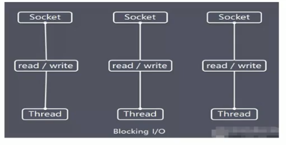

## 1.1 Netty 的介绍

1)  Netty是由JBOSS提供的-一个Java开源框架，现为Github. 上的独立项目。
2)  Netty 是一个异步的、基于事件驱动的网络应用框架，用以快速开发高性能、高可靠性的网络I0程序。
3)  Netty主要针对在TCP协议下，面向Clients端的高并发应用，或者Peer-to-Peer场景下的大量数据持续传输的应用。
4)  Netty本质是 一个NIO框架，适用于服务器通讯相关的多种应用场景
5)  要透彻理解Netty，需要先学习 NIO，这样我们才 能阅读Netty 的源码。

### IO 模型基本说明

1. I/O模型简单的理解:就是用什么样的通道进行数据的发送和接收，很大程度上决定了程序通信的性能
2. Java共支持3种网络编程模型/O模式: **BIO、 NIO、AIO**
3. **Java BIO**:同步并阻 塞(**传统阻塞型**)，服务器实现模式为一个连接一个线程，即客户端有连接请求时服务器端就需要启动一个线程进行处理，如果这个连接不做任何事情会造成不必要的线程开销 
4. **Java NIO**:**同步非阻塞**， 服务器案现模式为一个线程处理多个请求(连接)，即客户端发送的连接请求都会注册到多路复用器上，多路复用器轮询到连接有I/O请求就进行处理
5. **Java AIO(NIO.2)**:**异步非阻塞**，AIO引入异步通道的概念，采用了Proactor 模式，简化了程序编写，有效的请求才启动线程，它的特点是先由操作系统完成后才通知服务端程序启动线程去处理，一般适用于连接数较多且连接时间较长的应用。

### Java BIO基本介绍

1. Java **BIO**就是**传统的javaIO编程**，其相关的类和接口在java.io

2. **BIO(blockingI/O)**： **同步阻塞**，服务器实现模式为一个连接一个线程， 即客户端有连接请求时服务器端就需要启动一个线程进行处理，如果这个连接不做任何事情会造成不必要的线程开销，可以通过**线程池机制**改善(实现多个客户连接服务器)。

3. BIO方式**适用于连接数目比较小且固定的架构**，这种方式对服务器资源要求比较高，并发局限于应用中，JDK1.4以前的唯一选择，程序简单易理解。

**工作原理：**

**BIO编程简单流程:**

1. 服务器端启动一个ServerSocket
2. 客户端启动Socket对服务器进行通信，默认情况下服务器端需要对每个客户建立一个线程与之通讯
3. 客户端发出请求后，先咨询服务器是否有线程响应，如果没有则会等待，或者被拒绝

4.  如果有响应，客户端线程会等待请求结束后，在继续执行

**缺点：**

1. 每个请求都需要创建独立的线程，与对应的客户端进行数据Read，业务处理，数据Write 。
2. 当并发数较大时，需要创建大量线程来处理连接，系统资源占用较大。
3. 连接建立后，如果当前线程暂时没有数据可读，则线程就阻塞在Read操作上，造成线程资源浪费