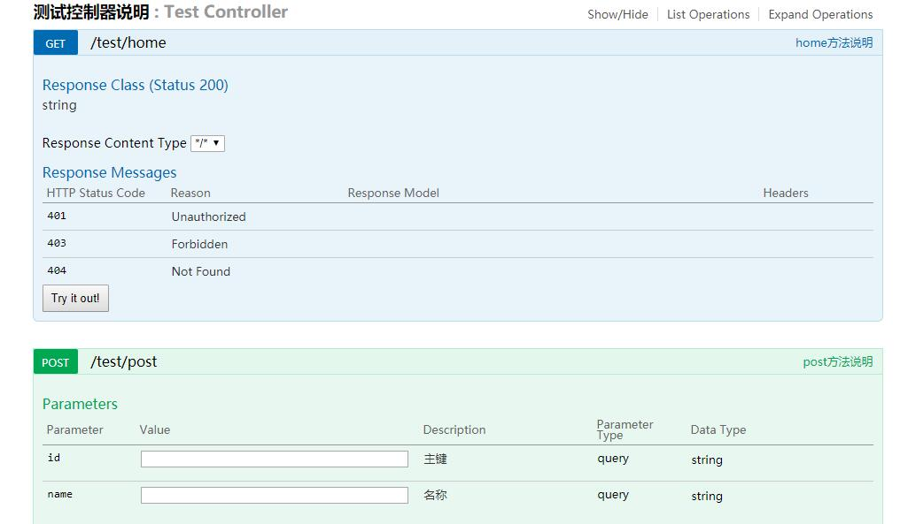

# springboot集成swagger

## 1.引入swagger依赖pom

```xml
		<!-- swagger -->
		<dependency>
			<groupId>io.springfox</groupId>
			<artifactId>springfox-swagger2</artifactId>
			<version>2.9.2</version>
		</dependency>
		<dependency>
			<groupId>io.springfox</groupId>
			<artifactId>springfox-swagger-ui</artifactId>
			<version>2.7.0</version>
		</dependency>
```

## 2.启动配置

```java
@Configuration
@EnableSwagger2
public class SwaggerConfig {
    @Bean
    public Docket createRestApi(){
        return new Docket(DocumentationType.SWAGGER_2).apiInfo(apiInfo())
                .select()
                .apis(RequestHandlerSelectors.any())
                .paths(Predicates.not(PathSelectors.regex("/error.*")))//错误路径不监控
        .build();
    }

    private ApiInfo apiInfo(){
        return new ApiInfoBuilder()
                .title("项目API文档")
                .build();
    }
}
```

## 3.在类中使用注解

```java

@Api(tags = {"测试控制器说明"})
@RestController
@RequestMapping(value = "/test")
public class TestController {
    /* 方法注解 */
    @ApiOperation(value = "home方法说明")
    @GetMapping("/home")
    public String home() {
        return "返回值";
    }

    @ApiOperation(value = "post方法说明")
    @ApiImplicitParams({
            @ApiImplicitParam(name="id",value="主键"),
            @ApiImplicitParam(name="name",value="名称")
    })
    @PostMapping("/post")
    public void post(@RequestParam String id,@RequestParam String name) {

    }
}
```

## 4.api文档查看



## 5.常用注解

1. @API: 请求类的说明

2. @ApiOperation: 方法的说明

2. 1 @ApiImplicitParams,@ApiImplicitParam: 方法参数的说明

3. @ApiResponses,@ApiResponse: 方法返回值的说明

4. @ApiModel: 用于 JavaBean 上面, 表示一个 JavaBean(如: 响应数据) 的信息

   4.1 @ApiModelProperty: 用在 JavaBean 类的属性上面, 说明属性的含义