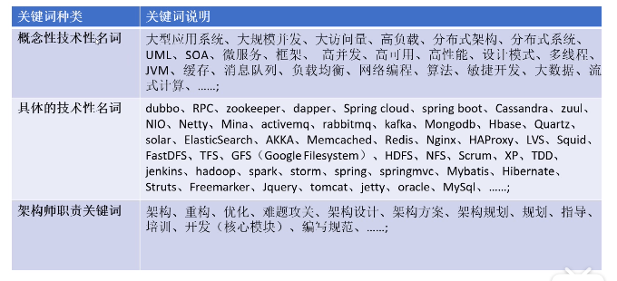
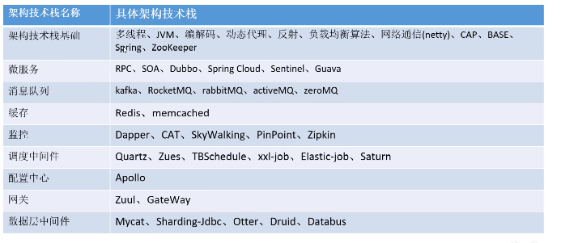
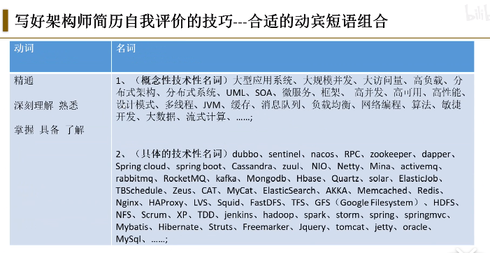
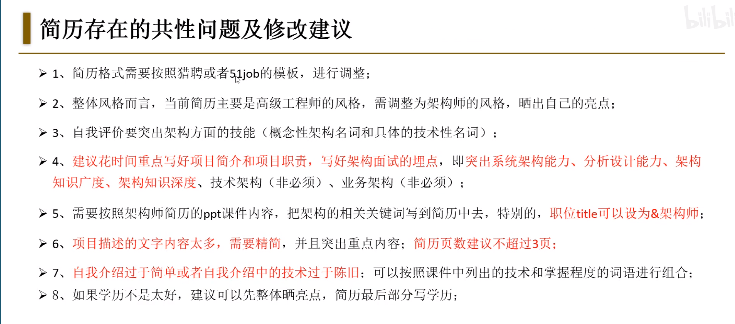

高级工程师日常职责(**项目职责**) :
重构、优化、项目需求分析、项目概要设计、项目结构规划、难题攻关、开发计划、技术方案、开发(核心模块)、编写规范、....

高级工程师**技能要求**:
大型应用系统、大规模并发、分布式架构、框架、高并发、 高可用、高性能、设计模式、多线程、JVM、缓存、消息队列、经验、学习能力、新技术(敏感)、(喜欢) 钻研、调优、精通、深刻理解、熟悉、掌握、了解

**高级工程师招聘需求和高级.工程师简历的关系**
1、高级工程师招聘的岗位描述是高级工程师简历中的日常职责
2、高级工程师招聘的岗位要求是高级工程师简历中自我评价中具体的技术

**写好高级工程师简历的关键**
➢写好简历中的日常职责和自我评价;
➢日常职责(突出高级工程师日常职责关键词)尽可能和高级工程师日常职责挂钩;
➢自我评价(突出高级工程师技能关键词)尽可能和高级工程师技能和具体技术挂钩;
➢写好项目介绍(项目简介、项目职责)

**中级VS高级**

 **工程师职责:开发**
➢熟悉需求
➢写设计文档
➢开发业务功能
➢自测
➢代码review
➢修改bug

**高级工程师架构师:性能优化、顶层设计、架构落地**
➢架构规划(前瞻性)
➢架构方案(方向性)
➢技术研究(攻关性)
➢技术选型(合理性)
➢解决难题(难度大)
➢架构落地(可运行)

**项目偏架构风格之秘籍**

1、主title是工程师，次title可以是架构师，**高级工程师&架构师**
2、**以架构师的思维写项目经验**
3、**参与架构工作**，非主导，突出架构潜力
**4、项目(产品、平台)的业务架构图、技术架构图**
**5、突出系统分析、系统架构能力**
**6、列出技术栈，晒技术难点、技术亮点**
7、建议掌握Star面试模型，**设置面试埋点**
8、项目收获(个人、或团队)
9、**切忌列一.堆开发的功能**，并且毫无技术含量，毫无亮点

**架构师日常职责关键词:架构规划、架构方案、架构设计、重构、优化、难题攻关、指导、培训、开发(核心模块)、编写规范;**
➢架构方案的设计和讨论_项目的业务架构图、技术架构图;
➢系统分析能力、设计能-_ML的核心用例模型、分析模型;
➢重构、服务化、业务拆分、jar包拆分、代码分层、具体代码重构;
➢性能调优-集群、缓存、消息中间件、线程池、多线程、批量处理、数据库等等;
➢核心功能-突出难点、流程复杂等特点，避免纯增删改查功能;
➢技术分享-分享相关热点技术、难点技术;

**项目经验的几大要点**
➢项目简介

- 简单描述项目

- 突出项目的亮点，**以高级工程师架构师的视角描述项目**

- 切忌描述内容太多，重点不突出，无亮点

项目简介:针对目前基础账户系统群服务分布不合理，接口目录不全，外围业务系统的高依赖性，进行服务治理。

- 项目职责

- 突出架构潜力

- 突出分析、设计能力

- 突出项目架构方案

- 学习能力

- 项目经验(架构能力埋点)

	

项目职责:
根据客户需求设计n-tiers架构文档，来满足新平台的业务需求，实现平台的可测试性，可维护性，可扩展性。
主要包括前端web应用服务器、后台SOA服务、负载均衡、分布式缓存、分布式文件存储、关系型数据库存储、消息队列、搜索引擎框架、基础底层开发框架。
基于Logstash、ElastiscSearch、 Ki bana三件套的分布式系统监控方案，产生TB级的日志数据存储在Hadoop的HDFS中，通过Hive查询接口实现基于HBase的一- 个数据仓库。

➢核心技术.

**自我评价：**

➢12年以上IT技术经验，7年左右电子商务经验，10年以上Java开发和设计经验，6年以上系统设计和架构设计经验;
➢熟悉分布式系统架构设计,具有大流量、人访问量、高负载环境下的系统开发及优化经验;
➢熟悉主流数据库: SQL Server、MySQL、 Oracle;
➢熟练hadoop/spark/storm等常用的分布式平台;
➢熟悉Redis、MongoDb、 HBase 等NoSQL管品;
➢熟悉主流开源框架: Spring、 J2EE， Memcached、 Ilbatis、 Quartz、 ElasticSearch、 AKKA 、Netty、RabbitMQ、Kafka、 KonckOutjs、 AngularJS、 Granfana, Spring cloud;熟 悉SOA和Web Services (REST,SOAP)系统框架;
➢了解其他编程语言C#,Scala, Node.js,Python,GoLang;
➢熟练掌握Power Designer软件建模工具，制作数据流程图、概念数据模型、物理数据模型以及面
➢向对象模型(00M)等;同时具有软件敏捷开发及项目管理经验。

技术名词：

